# 2-Indicators

``` r
library(ftsAnalysis)
#> Registered S3 method overwritten by 'quantmod':
#>   method            from
#>   as.zoo.data.frame zoo
```

Using this flows data to compile different types of indicators

- Donor Focused Indicators prefixed
- Donor to Recipient Indicators
- Donors to Destination Indicators
- Recipient Focused indicators
- Destination Focused indicators

## Donor

### indicator_donor_funding_consistency

``` r
donors <- indicator_donor_funding_consistency(flows)
table(donors$Funding_Consistency_Index)
#> 
#>   1 
#> 247
# library(ggplot2)
# ggplot(donors, aes(x = Funding_Consistency_Index)) +
#   geom_histogram(fill = "steelblue", color = "white") +
#   unhcrthemes::theme_unhcr(grid = "Y", axis = "X", axis_title = FALSE) +
#   labs(
#     title = "Distribution of Donor Funding Consistency Index",
#     x = "",
#     y = "Number of Donors",
#     caption = paste(
#     "Indicator interpretation:",
#     "Measures the proportion of years a donor provided funding relative to total 
#     years analyzed. Scores range 0-1 where 1 = consistent annual funding.",
#     "\n\n",
#     
#     "How to read the visualization:",
#     "X-axis shows consistency index values (0-1), Y-axis shows count of donors.
#     Bars represent frequency of donors at each consistency level.", "\n\n",
#     
#     "Humanitarian relevance:",
#     "Identifies reliable long-term partners vs sporadic funders, helping 
#     prioritize relationship building with consistent donors.", "\n\n",
#     
#     "Source: Financial Tracking Service (FTS) API."
#   )
#   )
```

### indicator_donor_relationship_duration

``` r
donors <- indicator_donor_relationship_duration(flows)
#table(donor$Relationship_Duration_Index)
library(ggplot2)
ggplot(donors, aes(x = Relationship_Duration_Index)) +
  geom_histogram(binwidth = 0.05, fill = "steelblue", color = "white") +
  unhcrthemes::theme_unhcr(grid = "Y", axis = "X", axis_title = FALSE) +
  labs(
    title = "Distribution of Donor Relationship Duration Index",
    x = "",
    y = "Number of Donors",
    caption = paste(
    "Indicator interpretation:",
    "Measures duration of donor's funding relationship relative to maximum 
    possible duration. 1 = active since earliest data, 0 = new entrant.", "\n\n",
    
    "How to read the visualization:",
    "Histogram shows distribution of duration scores. Left-skewed distribution 
    indicates many new donors, right-skewed indicates established 
    relationships.", "\n\n",
    
    "Humanitarian relevance:",
    "Long-term donors often have deeper contextual understanding and more 
    predictable funding patterns for strategic planning.", "\n\n",
    
    "Source: Financial Tracking Service (FTS) API."
  )
  )
```

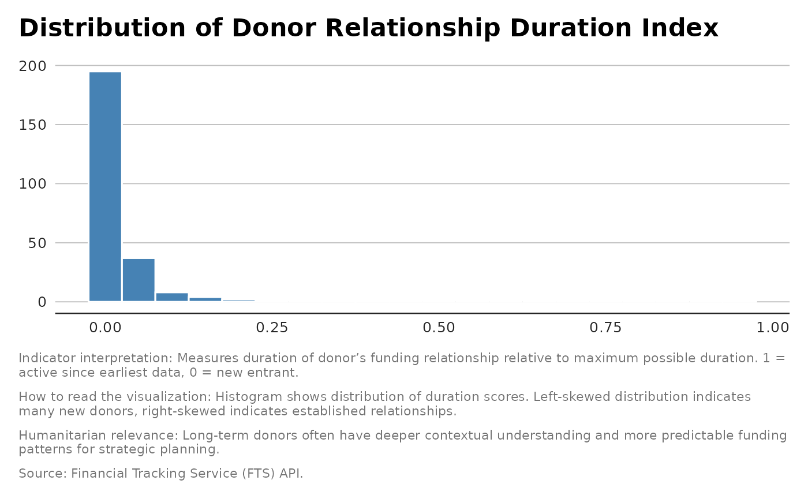

### indicator_donor_funding_growth

``` r
donors <- indicator_donor_funding_growth(flows)
#table(donors$Funding_Growth_Trend)
library(ggplot2)
ggplot(donors, aes(x = Funding_Growth_Trend)) +
  geom_histogram( fill = "steelblue", color = "white") +
  unhcrthemes::theme_unhcr(grid = "Y", axis = "X", axis_title = FALSE) +
  labs(
    title = "Distribution of Donor Funding Growth Trend",
    x = "",
    y = "Number of Donors",
    caption = paste(
    "Indicator interpretation:",
    "Linear regression slope of annual funding amounts over time. Positive 
    values = increasing funding, negative = decreasing funding.", "\n\n",
    
    "How to read the visualization:",
    "X-axis shows growth rate (USD per year), Y-axis shows donor count. Center 
    around zero indicates stable funding, right tail indicates growing donors.",
    "\n\n",
    
    "Humanitarian relevance:",
    "Identifies expanding vs contracting funding sources, helping target 
    advocacy and partnership efforts with growing donors.", "\n\n",
    
    "Source: Financial Tracking Service (FTS) API."
  )
  )
#> `stat_bin()` using `bins = 30`. Pick better value `binwidth`.
#> Warning: Removed 154 rows containing non-finite outside the scale range
#> (`stat_bin()`).
```

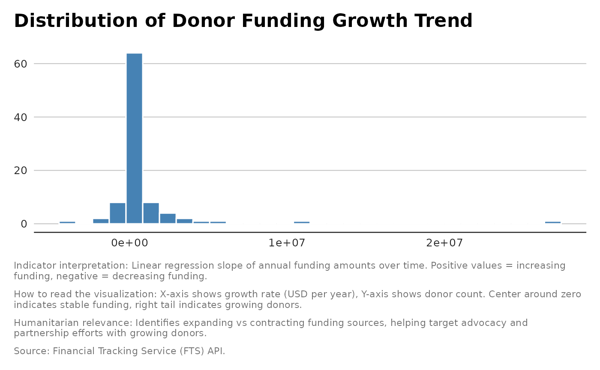

### indicator_donor_timing_consistency

``` r
donors <- indicator_donor_timing_consistency(flows)
#table(donors$Timing_Consistency)
library(ggplot2)
ggplot(donors, aes(x = Timing_Consistency)) +
  geom_histogram(binwidth = 0.05, fill = "steelblue", color = "white") +
  unhcrthemes::theme_unhcr(grid = "Y", axis = "X", axis_title = FALSE) +
  labs(
    title = "Distribution of Donor Timing Consistency",
    x = "",
    y = "Number of Donors",
    caption = paste(
    "Indicator interpretation:",
    "Measures regularity of funding distribution across month
    (1 = evenly spread, 0 = highly seasonal/erratic). Based on monthly 
    funding share dispersion.", "\n\n",
    
    "How to read the visualization:",
    "Histogram shows consistency scores. Higher values indicate predictable
    monthly funding patterns, lower values indicate lumpy or seasonal
    disbursements.", "\n\n",
    
    "Humanitarian relevance:",
    "Predictable timing enables better cash flow management and program
    continuity, reducing operational disruptions in emergency responses.",
    "\n\n",
    
    "Source: Financial Tracking Service (FTS) API."
  )
  )
#> Warning: Removed 106 rows containing non-finite outside the scale range
#> (`stat_bin()`).
```

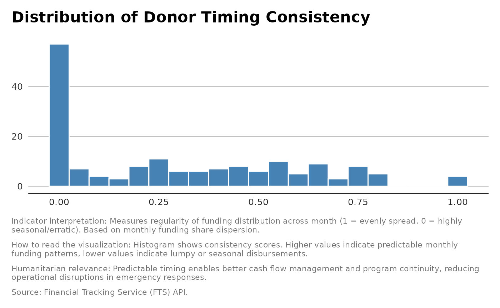

### indicator_donor_systemic_concentration

``` r
donors <- indicator_donor_systemic_concentration(flows)

#table(donors$Donor_Concentration_Index)

library(ggplot2)
ggplot(donors, aes(x = Donor_Concentration_Index)) +
  geom_histogram(binwidth = 0.05, fill = "steelblue", color = "white") +
  unhcrthemes::theme_unhcr(grid = "Y", axis = "X", axis_title = FALSE) +
  labs(
    title = "Distribution of Donor Concentration Index",
    x = "",
    y = "Number of Donors",
    caption = paste(
    "Indicator interpretation:",
    "Herfindahl-Hirschman Index measuring portfolio concentration across 
    recipients (0 = highly diversified, 1 = focused on few recipients).",
    "\n\n",
    
    "How to read the visualization:",
    "X-axis shows concentration level. Left side indicates donors spreading
    funds widely, right side indicates focused funding on few partners.", "\n\n",
    
    "Humanitarian relevance:",
    "Helps identify donors with broad partner networks vs specialized 
    relationships, informing partnership and resource mobilization strategies.",
    "\n\n",
    
    "Source: Financial Tracking Service (FTS) API."
  )
  )
```

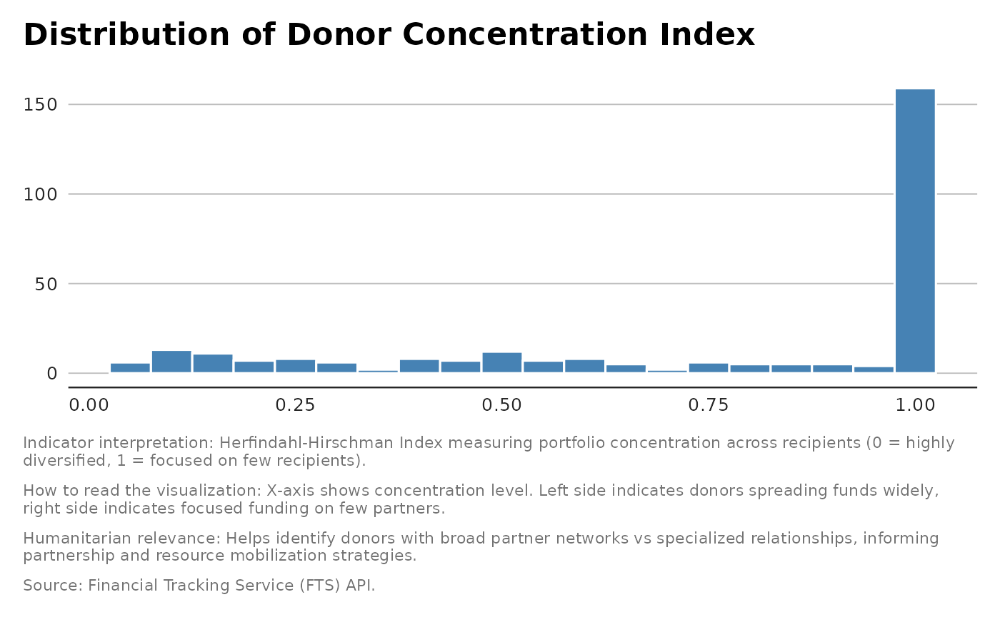

### indicator_donor_knowledge_sharing_intensity

``` r
donors <- indicator_donor_knowledge_sharing_intensity(flows)
#table(donors$Knowledge_Sharing_Intensity)

library(ggplot2)
# Basic histogram of Knowledge Sharing Intensity
ggplot(donors, aes(x = Knowledge_Sharing_Intensity)) +
  geom_histogram(binwidth = 0.05, fill = "steelblue", color = "white") +
  unhcrthemes::theme_unhcr(grid = "Y", axis = "X", axis_title = FALSE) +
  labs(
    title = "Distribution of Donor Knowledge Sharing Intensity",
    x = "",
    y = "Number of Donors",
    caption = paste(
    "Indicator interpretation:",
    "Proportion of flows mentioning collaboration, learning, or assessment
    activities in descriptions (0 = no mention, 1 = all flows include 
    knowledge components).", "\n\n",
    
    "How to read the visualization:",
    "Histogram shows distribution of knowledge sharing emphasis. Higher values 
    indicate donors prioritizing learning and coordination in funding.", "\n\n",
    
    "Humanitarian relevance:",
    "Identifies donors supporting system-wide learning and coordination, 
    crucial for improving response effectiveness and accountability.", "\n\n",
    
    "Source: Financial Tracking Service (FTS) API."
  )
  )
```

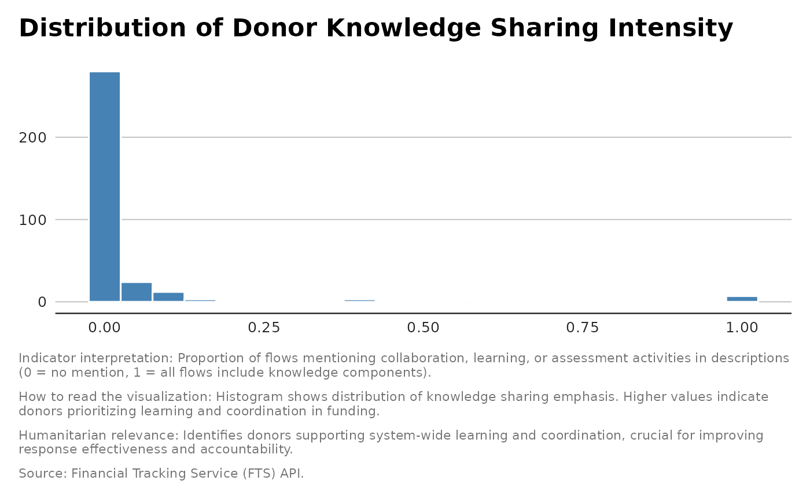

### indicator_donor_sector_alignment

``` r

flows |>
      tidyr::unnest(destinationObjects, names_repair = "unique", names_sep = "_") |>
      dplyr::filter(destinationObjects_type == "GlobalCluster") |>
      dplyr::pull(destinationObjects_name) |>
      unlist() |>
      unique()
#>  [1] "Nutrition"                                 
#>  [2] "Health"                                    
#>  [3] "Other"                                     
#>  [4] "Emergency Shelter and NFI"                 
#>  [5] "Water Sanitation Hygiene"                  
#>  [6] "Food Security"                             
#>  [7] "Logistics"                                 
#>  [8] "Coordination and support services"         
#>  [9] "Protection - Gender-Based Violence"        
#> [10] "Multi-sector"                              
#> [11] "Protection"                                
#> [12] "Education"                                 
#> [13] "Early Recovery"                            
#> [14] "Protection - Child Protection"             
#> [15] "Protection - Mine Action"                  
#> [16] "Agriculture"                               
#> [17] "Protection - Housing, Land and Property"   
#> [18] "Camp Coordination / Management"            
#> [19] "Protection - Human Trafficking & Smuggling"
#> [20] "Multipurpose Cash"                         
#> [21] "Emergency Telecommunications"

# pragmatic default weights - illustrative defaults emphasizing life-saving sectors 
# (Nutrition, Health, WASH, Food Security) and cash/multi-sector where relevant.
library(tibble)

sectors <- c(
 "Nutrition", 
 "Health", 
 "Emergency Shelter and NFI", 
 "Water Sanitation Hygiene",
 "Food Security",
 "Logistics", 
 "Protection - Gender-Based Violence", 
 "Protection - Child Protection",
 "Protection",
 "Multipurpose Cash", 
 "Education",
 "Multi-sector",
 "Protection - Housing, Land and Property",
 "Protection - Human Trafficking & Smuggling", 
 "Coordination and support services",
 "Camp Coordination / Management",
 "Emergency Telecommunications", 
 "Agriculture",
 "Early Recovery",
 "Protection - Mine Action", 
 "Other"
)

# Adjusted scores based on funding collapse and operational risk

adjusted_scores <- c(
  10,  # Nutrition: Life-saving and first-line response; malnutrition spikes in
  #crises. Funding collapse means ration cuts, so priority remains highest.
  9,   # Health: Essential for survival; clinics reverting to 1990s models 
  #(minimal staff, basic meds). High priority to prevent mortality.
  8,   # Emergency Shelter and NFI: Critical for displaced populations;
  #exposure risk rises with underfunding. Still high but slightly below health/nutrition.
  8,   # Water Sanitation Hygiene (WASH): Prevents disease outbreaks; 
  #cholera risk escalates when systems fail. Needs strong prioritization.
  7,   # Food Security: Linked to nutrition but broader (agriculture, livelihoods).
  #Funding gaps mean rationing; still vital but slightly less than direct nutrition.
  6,   # Logistics: Backbone for all sectors; underfunding reduces supply chain 
  #resilience. Important but not life-saving on its own.
  7,   # Protection - Gender-Based Violence: GBV spikes in fragile contexts; 
  #services often first to be cut. Needs strong prioritization for dignity and safety.
  6,   # Protection - Child Protection: Critical for safeguarding vulnerable
  #children; funding collapse risks exploitation. Medium-high priority.
  5,   # Protection (general): Important for rights and safety but less 
  #immediately life-saving than GBV or child protection.
  9,   # Multipurpose Cash: Severely underfunded (only ~20% coverage);
  #key for dignity and flexibility. High priority to maintain household resilience.
  8,   # Education: Collapsing (21% funded); long-term impact on recovery 
  #and protection. Elevated priority despite being non-life-saving.
  6,   # Multi-sector: Coordination across sectors matters, but direct impact 
  # is less urgent than core life-saving interventions.
  4,   # Protection - Housing, Land and Property: Important for durable
  #solutions, but less urgent during acute collapse.
  4,   # Protection - Human Trafficking & Smuggling: Serious risk but narrower
  #scope; medium-low priority compared to GBV/child protection.
  3,   # Coordination and support services: Necessary for system functioning,
  # but deprioritized when survival sectors collapse.
  3,   # Camp Coordination / Management: Important for organized response,
  #but less critical than food, health, WASH.
  3,   # Emergency Telecommunications: Enables operations but not directly
  #life-saving; deprioritized under severe funding constraints.
  5,   # Agriculture: Supports food security and recovery; medium priority 
  #as immediate needs dominate.
  8,   # Early Recovery: Only 17% funded; crucial for resilience and 
  #preventing protracted crises. Elevated priority despite systemic collapse.
  2,   # Protection - Mine Action: Important for safety but less urgent 
  # than health/nutrition during acute funding collapse.
  1    # Other: Catch-all category; lowest priority given resource scarcity.
)


sector_capacity <- tibble::tibble(
  sector = sectors,
  raw_score = adjusted_scores) |>
  dplyr::mutate(
    capacity_weight = raw_score / sum(raw_score)  # normalize to sum to 1
  ) |>
  dplyr::select(sector, capacity_weight)

knitr::kable(sector_capacity |> dplyr::arrange(desc(capacity_weight)))
```

| sector                                     | capacity_weight |
|:-------------------------------------------|----------------:|
| Nutrition                                  |       0.0819672 |
| Health                                     |       0.0737705 |
| Multipurpose Cash                          |       0.0737705 |
| Emergency Shelter and NFI                  |       0.0655738 |
| Water Sanitation Hygiene                   |       0.0655738 |
| Education                                  |       0.0655738 |
| Early Recovery                             |       0.0655738 |
| Food Security                              |       0.0573770 |
| Protection - Gender-Based Violence         |       0.0573770 |
| Logistics                                  |       0.0491803 |
| Protection - Child Protection              |       0.0491803 |
| Multi-sector                               |       0.0491803 |
| Protection                                 |       0.0409836 |
| Agriculture                                |       0.0409836 |
| Protection - Housing, Land and Property    |       0.0327869 |
| Protection - Human Trafficking & Smuggling |       0.0327869 |
| Coordination and support services          |       0.0245902 |
| Camp Coordination / Management             |       0.0245902 |
| Emergency Telecommunications               |       0.0245902 |
| Protection - Mine Action                   |       0.0163934 |
| Other                                      |       0.0081967 |

``` r

donors <- indicator_donor_sector_alignment(flows, sector_capacity)

#table(donor$Sector_Alignment )

library(ggplot2)
ggplot(donors, aes(x =Sector_Alignment )) +
  geom_histogram(binwidth = 0.05, fill = "steelblue", color = "white") +
  unhcrthemes::theme_unhcr(grid = "Y", axis = "X", axis_title = FALSE) +
  labs(
    title = "Distribution of Donor Sector Alignment",
    x = "",
    y = "Number of Destination",
    caption = paste(
    "Indicator interpretation:",
    "Weighted alignment between donor funding distribution and internal sector
    capacity priorities (0 = misaligned, 1 = perfectly aligned with 
    capacity weights).", "\n\n",
    
    "How to read the visualization:",
    "Histogram shows alignment scores. Higher values indicate donors funding 
    sectors matching organizational capacities and strategic priorities.",
    "\n\n",
    
    "Humanitarian relevance:",
    "Helps identify donors whose funding priorities match operational strengths,
    enabling more effective resource allocation and partnership building.",
    "\n\n",
    
    "Source: Financial Tracking Service (FTS) API."
  )
  )
```

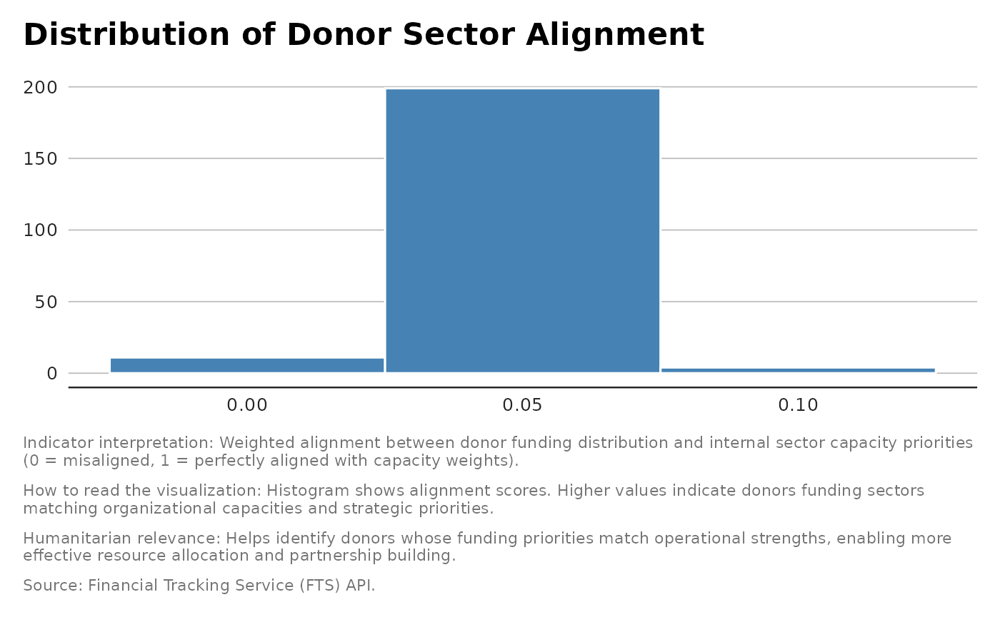

### indicator_donor_geographic_alignment

``` r

destinations <- flows |>
      tidyr::unnest(destinationObjects, names_repair = "unique", names_sep = "_") |>
      dplyr::filter(destinationObjects_type == "Location") |>
      dplyr::pull(destinationObjects_name) |>
      unlist() |>
      unique()
#dput(destinations)

# High-visibility, acute crises get funded
high_visibility <- c(
  "Ukraine", "Syrian Arab Republic", "Occupied Palestinian Territory",
  "Sudan", "South Sudan", "Yemen", "Afghanistan", "Myanmar",
  "Ethiopia", "Somalia", "Democratic Republic of the Congo",
  "Central African Republic", "Haiti"
)

# Long-standing crises with major donor attention maintain coverage
long_standing <- c(
  "Lebanon", "Jordan", "Iraq", "Türkiye", "Bangladesh", "Chad",
  "Cameroon", "Niger", "Burkina Faso", "Mali", "Nigeria",
  "Colombia", "Venezuela, Bolivarian Republic of"
)

# Regional refugee responses collapse
regional_refugee <- c(
  "Region - Southern and Eastern Africa", "Region - Middle East and Northern Africa",
  "Region - West and Central Africa", "Region - Latin America and the Caribbean",
  "Region - Asia and the Pacific", "Uganda", "Kenya", "Tanzania, United Republic of",
  "Djibouti", "Mauritania", "Cameroon", "Moldova, Republic of"
)

# Lower-profile crises get abandoned
lower_profile <- c(
  "Burundi", "Rwanda", "Eritrea", "Nepal", "Georgia", "Cuba",
  "Dominican Republic", "Madagascar", "Mozambique", "Angola", "Malawi",
  "Comoros", "Liberia", "Côte d'Ivoire", "Senegal", "Ghana", "Guinea",
  "Guinea-Bissau", "Lesotho", "Eswatini", "Zambia", "Cambodia",
  "Lao People's Democratic Republic", "Philippines", "Timor-Leste",
  "Sri Lanka", "Togo", "Benin", "Gambia", "Nicaragua", "Honduras",
  "El Salvador", "Guatemala", "Costa Rica", "Peru", "Ecuador", "Panama",
  "Bolivia, Plurinational State of", "Papua New Guinea", "Solomon Islands",
  "Kiribati", "Vanuatu", "Micronesia, Federated States of", "Tonga",
  "Fiji", "Cook Islands", "Tuvalu", "Samoa", "Nauru", "Niue", "Palau",
  "Maldives", "Armenia", "Uzbekistan", "Kazakhstan", "Turkmenistan",
  "Azerbaijan", "Tajikistan", "Kyrgyzstan", "Mongolia", "Mauritius",
  "Cape Verde", "Equatorial Guinea", "Gabon", "Botswana", "Namibia",
  "Seychelles", "Trinidad and Tobago", "Grenada", "Saint Lucia",
  "Saint Vincent and the Grenadines", "Barbados", "Guyana", "Suriname",
  "Belize", "Anguilla (United Kingdom)", "Aruba (Netherlands)",
  "Curaçao (Netherlands)"
)


donor <- indicator_donor_geographic_alignment(flows, 
                       priority_destinations = high_visibility)
#table(donor$Geographic_Alignment)

library(ggplot2)
ggplot(donor, aes(x = Geographic_Alignment)) +
  geom_histogram( fill = "steelblue", color = "white") +
  unhcrthemes::theme_unhcr(grid = "Y", axis = "X", axis_title = FALSE) +
  labs(
    title = "Distribution of Donor Geographic Alignment to High Visibility Location",
    x = "",
    y = "Number of Destination",
   caption = paste(
    "Indicator interpretation:",
    "Jaccard similarity between donor-funded locations and priority 
    locations (0 = no overlap, 1 = identical geographic focus).", "\n\n",
    
    "How to read the visualization:",
    "Histogram shows alignment with specified priority locations. Higher 
    values indicate donors active in organizational priority countries.",
    "\n\n",
    
    "Humanitarian relevance:",
    "Identifies natural partners for priority crises and reveals funding gaps 
    in key locations needing advocacy attention.", "\n\n",
    
    "Source: Financial Tracking Service (FTS) API."
  )
  )
#> `stat_bin()` using `bins = 30`. Pick better value `binwidth`.
```

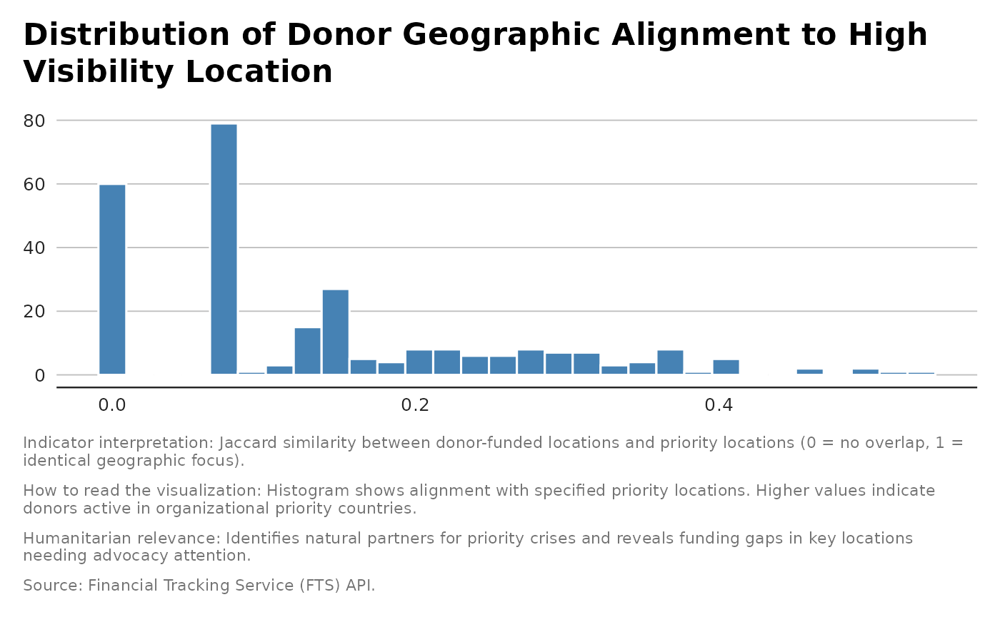

### indicator_cross_donor_systemic_destination_alignment

``` r

# Compute alignment
alignment <- indicator_cross_donor_systemic_destination_alignment(flows)

# Viz
library(ggplot2)
library(dplyr)
#> 
#> Attaching package: 'dplyr'
#> The following objects are masked from 'package:stats':
#> 
#>     filter, lag
#> The following objects are masked from 'package:base':
#> 
#>     intersect, setdiff, setequal, union


# Compute total funding per donor
top_donors <- flows |>
  tidyr::unnest(sourceObjects, names_sep = "_") |>
  dplyr::filter(sourceObjects_type == "Organization") |>
  dplyr::rename(donor = sourceObjects_name) |>
  dplyr::group_by(donor) |>
  dplyr::summarise(total_funding = sum(amountUSD, na.rm = TRUE),
                   .groups = "drop") |>
  dplyr::arrange(desc(total_funding)) |>
  dplyr::slice_head(n = 15) |>
  dplyr::pull(donor)

# Filter alignment to top donors
alignment_top <- alignment |>
  dplyr::filter(donor1 %in% top_donors, donor2 %in% top_donors) |>
    dplyr::mutate(
      donor1 = stringr::str_wrap(donor1, width = 40),
      donor2 = stringr::str_wrap(donor2, width = 40)
    )

# Prepare data for ggplot
plot_df <- alignment_top |>
  dplyr::mutate(
    donor1 = factor(donor1),
    donor2 = factor(donor2)
  )

# Heatmap
ggplot(plot_df, aes(x = donor2, y = donor1, fill = Destination_Alignment)) +
  geom_tile(color = "white") +
  scale_fill_viridis_c(option = "plasma", na.value = "grey80", limits = c(0, 1)) +
  unhcrthemes::theme_unhcr(grid = FALSE, axis =  FALSE, axis_title = FALSE, legend=TRUE) +
  theme(axis.text.x = element_text(angle = 45, hjust = 1)) +
  labs(
    title = "Top 15 Donors to Destination Alignment",
    x = "Donor 2",
    y = "Donor 1",
    fill = "Jaccard\nSimilarity",
    caption = paste(
    "Indicator interpretation:",
    "Jaccard similarity measuring overlap in funded locations/clusters 
    between donor pairs (0 = no overlap, 1 = identical destination portfolios).",
    "\n\n",
    
    "How to read the visualization:",
    "Heatmap shows pairwise alignment. Dark colors indicate high 
    geographic/thematic overlap, light colors indicate complementary coverage.",
    "\n\n",
    
    "Humanitarian relevance:",
    "Identifies donor clusters with similar focus areas, helping coordinate 
    advocacy and avoid duplication in under-funded crises.", "\n\n",
    
    "Source: Financial Tracking Service (FTS) API."
  )
  )
```


## Donor to Recipient

### indicator_donor_recipient_relationship_duration

``` r
donor_recipient <- indicator_donor_recipient_relationship_duration(flows)
#table(donor_recipient$Relationship_Duration_Index)

library(ggplot2)
ggplot(donor_recipient, aes(x = Relationship_Duration_Index)) +
  geom_histogram( fill = "green", color = "white") +
  unhcrthemes::theme_unhcr(grid = "Y", axis = "X", axis_title = FALSE) +
  labs(
    title = "Distribution of Donor Recipient Relationship Duration Index",
    x = "",
    y = "Number of Donor-Recipient Pairs",
    caption = paste(
    "Indicator interpretation:",
    "Normalized duration of active funding relationships between donor-recipient
    pairs (0=new relationship, 1=active since earliest data).", "\n\n",
    
    "How to read the visualization:",
    "Histogram shows relationship longevity across partnerships. Right-skewed 
    distribution indicates many new relationships, left-skewed indicates 
    established partnerships.", "\n\n",
    
    "Humanitarian relevance:",
    "Long-term partnerships build trust, contextual understanding, and
    operational efficiency, leading to more effective crisis response.", "\n\n",
    
    "Source: Financial Tracking Service (FTS) API."
  )
  )
#> `stat_bin()` using `bins = 30`. Pick better value `binwidth`.
#> Warning: Removed 1480 rows containing non-finite outside the scale range
#> (`stat_bin()`).
```

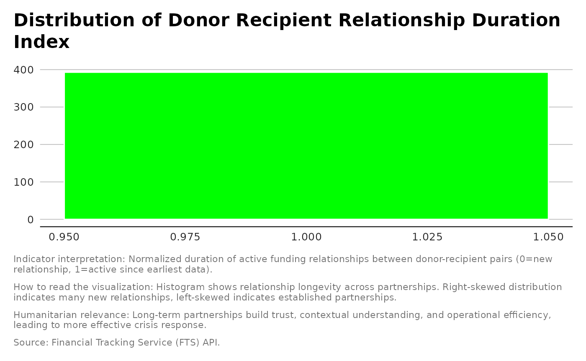

### indicator_donor_recipient_funding_growth

``` r
donor_recipient <- indicator_donor_recipient_funding_growth(flows)
#table(donor_recipient$Funding_Growth_Trend)

library(ggplot2)
ggplot(donor_recipient, aes(x = Funding_Growth_Trend)) +
  geom_histogram( fill = "green", color = "white") +
  unhcrthemes::theme_unhcr(grid = "Y", axis = "X", axis_title = FALSE) +
  labs(
    title = "Distribution of Donor Recipient Funding Growth Trend",
    x = "",
    y = "Number of Donor-Recipient Pairs",
    caption = paste(
    "Indicator interpretation:",
    "Linear regression slope of annual funding amounts between donor-recipient 
    pairs. Positive values=increasing funding, negative=decreasing funding.", "\n\n",
    
    "How to read the visualization:",
    "Histogram shows growth patterns across partnerships. Center around zero 
    indicates stable funding, right tail indicates expanding partnerships.", "\n\n",
    
    "Humanitarian relevance:",
    "Identifies growing vs contracting funding relationships, helping prioritize
    partnership development and identify successful collaboration models.", 
    "\n\n",
    
    "Source: Financial Tracking Service (FTS) API."
  )
  )
#> `stat_bin()` using `bins = 30`. Pick better value `binwidth`.
#> Warning: Removed 1480 rows containing non-finite outside the scale range
#> (`stat_bin()`).
```

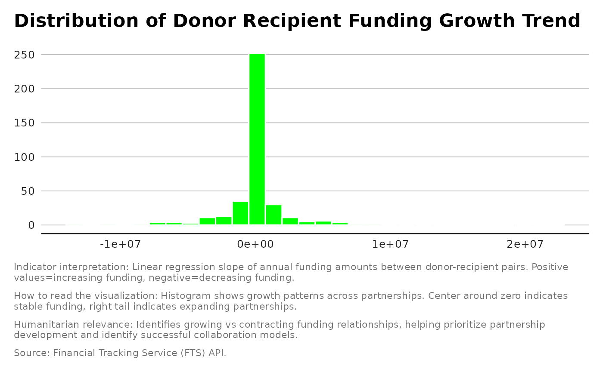

### indicator_donor_recipient_stability

``` r
donor_recipient <- indicator_donor_recipient_stability(flows)
#table(donor_recipient$DonorRecipient_Stability_Index)

library(ggplot2)
ggplot(donor_recipient, aes(x = DonorRecipient_Stability_Index)) +
  geom_histogram( fill = "green", color = "white") +
  unhcrthemes::theme_unhcr(grid = "Y", axis = "X", axis_title = FALSE) +
  labs(
    title = "Distribution of Donor Recipient Stability Index",
    x = "",
    y = "Number of Donor-Recipient Pairs",
    caption = paste(
    "Indicator interpretation:",
    "Proportion of years with active funding between donor-recipient pairs 
    (0=sporadic funding, 1=consistent annual funding throughout relationship).",
    "\n\n",
    
    "How to read the visualization:",
    "Histogram shows funding consistency patterns. Higher values indicate 
    reliable annual partnerships, lower values indicate intermittent engagement.",
    "\n\n",
    
    "Humanitarian relevance:",
    "Consistent funding enables long-term programming, staff retention, and 
    institutional strengthening rather than project-based short-term engagements.", 
    "\n\n",
    
    "Source: Financial Tracking Service (FTS) API."
  )
  )
#> `stat_bin()` using `bins = 30`. Pick better value `binwidth`.
```

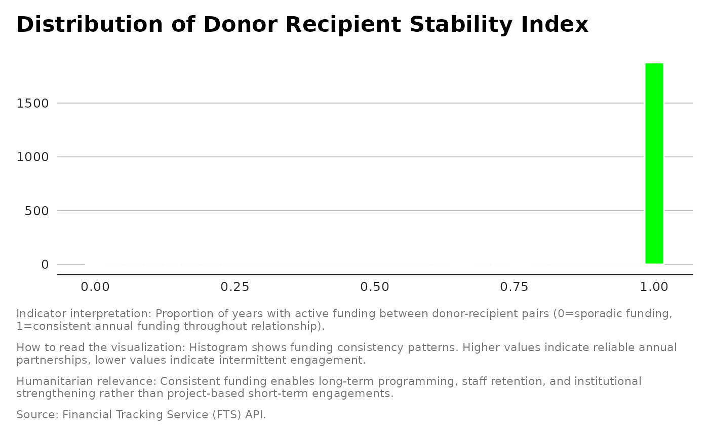

### indicator_donor_recipient_concentration

``` r
donor_recipient <- indicator_donor_recipient_concentration(flows)
#table(donor_recipient$DonorRecipient_Stability_Index)

library(ggplot2)
ggplot(donor_recipient, aes(x = DonorRecipient_Concentration_Index)) +
  geom_histogram( fill = "green", color = "white") +
  unhcrthemes::theme_unhcr(grid = "Y", axis = "X", axis_title = FALSE) +
  labs(
    title = "Distribution of Donor Recipient Concentration Index",
    x = "",
    y = "Number of Donor-Recipient Pairs",
    caption = paste(
    "Indicator interpretation:",
    "Share of recipient's total funding coming from specific donor (0-1). 
    Higher values indicate recipient dependency on that donor.", "\n\n",
    
    "How to read the visualization:",
    "Histogram shows dependency levels across partnerships. Values near 1 
    indicate critical donor dependencies requiring diversification strategies.",
    "\n\n",
    
    "Humanitarian relevance:",
    "Identifies vulnerable partnerships where recipient organizations risk 
    severe disruption if key donors change funding priorities.", "\n\n",
    
    "Source: Financial Tracking Service (FTS) API."
  )
  )
#> `stat_bin()` using `bins = 30`. Pick better value `binwidth`.
#> Warning: Removed 1 row containing non-finite outside the scale range
#> (`stat_bin()`).
```

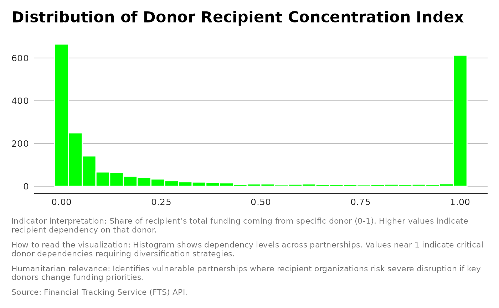

### indicator_donor_recipient_trend

``` r
donor_recipient <- indicator_donor_recipient_trend(flows)
#table(donor_recipient$DonorRecipient_Trend_Index)

library(ggplot2)
ggplot(donor_recipient, aes(x = DonorRecipient_Trend_Index)) +
  geom_histogram( fill = "green", color = "white") +
  unhcrthemes::theme_unhcr(grid = "Y", axis = "X", axis_title = FALSE) +
  labs(
    title = "Distribution of Donor Recipient Trend Index",
    x = "",
    y = "Number of Donor-Recipient Pairs",
    caption = paste(
    "Indicator interpretation:",
    "Linear trend of funding amounts between donor-recipient pairs over time. 
    Positive=increasing investment, negative=phasing out partnership.", "\n\n",
    
    "How to read the visualization:",
    "Histogram shows partnership evolution patterns. Right of zero indicates 
    growing collaborations, left indicates declining engagements.", "\n\n",
    
    "Humanitarian relevance:",
    "Reveals evolving partnership strategies - scaling successful collaborations
    vs exiting less effective ones - informing relationship management.", "\n\n",
    
    "Source: Financial Tracking Service (FTS) API."
  )
  )
#> `stat_bin()` using `bins = 30`. Pick better value `binwidth`.
#> Warning: Removed 1480 rows containing non-finite outside the scale range
#> (`stat_bin()`).
```

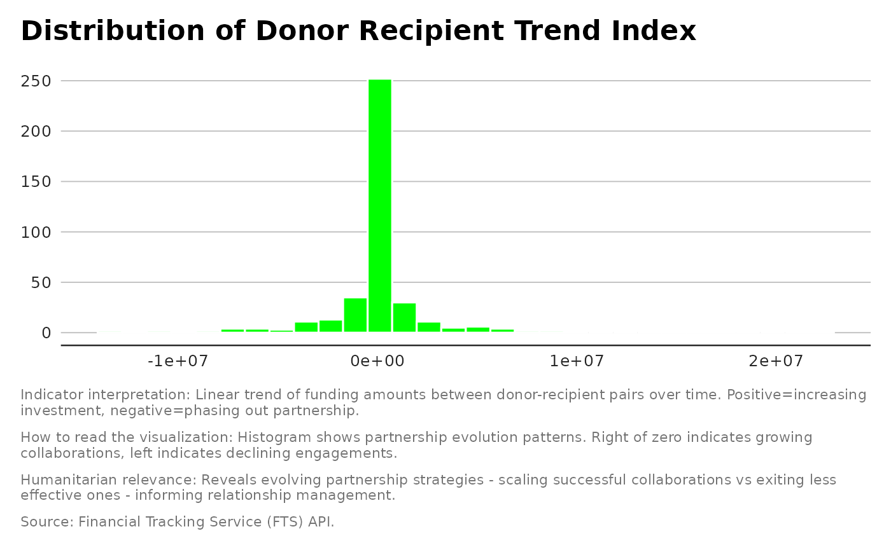

### indicator_donor_recipient_reciprocity

``` r
donor_recipient <- indicator_donor_recipient_reciprocity(flows)
#table(donor_recipient$DonorRecipient_Reciprocity_Ratio)

library(ggplot2)
ggplot(donor_recipient, aes(x = DonorRecipient_Reciprocity_Ratio)) +
  geom_histogram( fill = "green", color = "white") +
  unhcrthemes::theme_unhcr(grid = "Y", axis = "X", axis_title = FALSE) +
  labs(
    title = "Distribution of Donor Recipient Reciprocity Ratio",
    x = "",
    y = "Number of Donor-Recipient Pairs",
    caption = paste(
    "Indicator interpretation:",
    "Binary indicator of mutual funding relationships where both organizations 
    act as donor and recipient to each other (0=one-way, 1=reciprocal).", "\n\n",
    
    "How to read the visualization:",
    "Two bars showing proportion of one-way vs reciprocal partnerships. 
    Higher reciprocal values indicate collaborative funding ecosystems.",
    "\n\n",
    
    "Humanitarian relevance:",
    "Reciprocal funding indicates consortia, pooled funds, or collaborative 
    programming arrangements that enhance coordination and local ownership.",
    "\n\n",
    
    "Source: Financial Tracking Service (FTS) API."
  )
  )
#> `stat_bin()` using `bins = 30`. Pick better value `binwidth`.
```

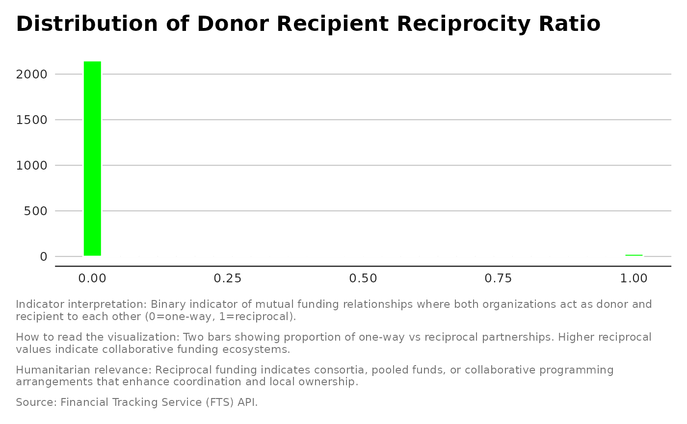

## Donor to Destination

### indicator_donor_destination_coverage

``` r
donor <- indicator_donor_destination_coverage(flows)
#table(donor$DonorDestination_Concentration_Index)

library(ggplot2)
ggplot(donor, aes(x = DonorDestination_Coverage_Index)) +
  geom_histogram( fill = "steelblue", color = "white") +
  unhcrthemes::theme_unhcr(grid = "Y", axis = "X", axis_title = FALSE) +
  labs(
    title = "Distribution of Donor Destination Coverage Index",
    x = "",
    y = "Number of Donors",
    caption = paste(
    "Indicator interpretation:",
    "Proportion of total destinations supported by donor (0 = few locations,
    1 = active in all locations in dataset).", "\n\n",
    
    "How to read the visualization:",
    "Histogram shows coverage breadth. Higher values indicate donors with global
    reach, lower values indicate regionally focused donors.", "\n\n",
    
    "Humanitarian relevance:",
    "Identifies global players vs regional specialists, informing crisis-specific
    partnership strategies and gap analysis.", "\n\n",
    
    "Source: Financial Tracking Service (FTS) API."
  )
  )
#> `stat_bin()` using `bins = 30`. Pick better value `binwidth`.
```

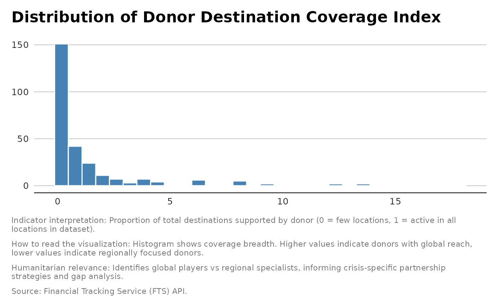

### indicator_donor_destination_trend

``` r
donor <- indicator_donor_destination_trend(flows)
#table(donor$DonorDestination_Focus_Trend)

library(ggplot2)
ggplot(donor, aes(x = DonorDestination_Focus_Trend)) +
  geom_histogram( fill = "steelblue", color = "white") +
  unhcrthemes::theme_unhcr(grid = "Y", axis = "X", axis_title = FALSE) +
  labs(
    title = "Distribution of Donor Destination Focus Trend",
    x = "",
    y = "Number of Donors",
    caption = paste(
    "Indicator interpretation:",
    "Linear trend of geographic concentration over time (negative = diversifying,
    positive = focusing, zero = stable portfolio strategy).", "\n\n",
    
    "How to read the visualization:",
    "Histogram shows trend direction. Left of zero indicates donors broadening 
    geographic scope, right indicates narrowing focus.", "\n\n",
    
    "Humanitarian relevance:",
    "Reveals evolving donor strategies - expansion into new crises vs 
    consolidation in core locations - for anticipating partnership 
    opportunities.", "\n\n",
    
    "Source: Financial Tracking Service (FTS) API."
  )
  )
#> `stat_bin()` using `bins = 30`. Pick better value `binwidth`.
#> Warning: Removed 146 rows containing non-finite outside the scale range
#> (`stat_bin()`).
```

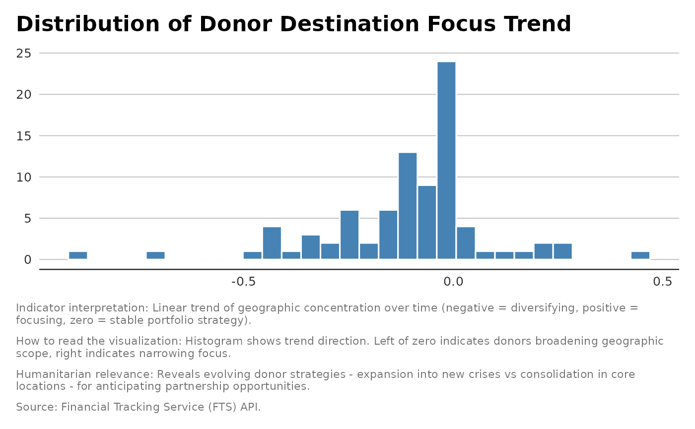

### indicator_donor_destination_concentration

``` r
donor <- indicator_donor_destination_concentration(flows)
#table(donor$DonorDestination_Concentration_Index)

library(ggplot2)
ggplot(donor, aes(x = DonorDestination_Concentration_Index)) +
  geom_histogram( fill = "steelblue", color = "white") +
  unhcrthemes::theme_unhcr(grid = "Y", axis = "X", axis_title = FALSE) +
  labs(
    title = "Distribution of Donor Destination Concentration Index",
    x = "",
    y = "Number of Donors",
    caption = paste(
    "Indicator interpretation:",
    "Herfindahl-Hirschman Index measuring geographic portfolio concentration 
    (0 = highly diversified, 1 = focused on few locations/plans).", "\n\n",
    
    "How to read the visualization:",
    "Histogram shows concentration levels. Left indicates global spread, right 
    indicates focused geographic operations in few crises.", "\n\n",
    
    "Humanitarian relevance:",
    "Helps understand donor geographic strategies - specialized crisis 
    responders vs broad global supporters - for targeted engagement.", "\n\n",
    
    "Source: Financial Tracking Service (FTS) API."
  )
  )
#> `stat_bin()` using `bins = 30`. Pick better value `binwidth`.
```

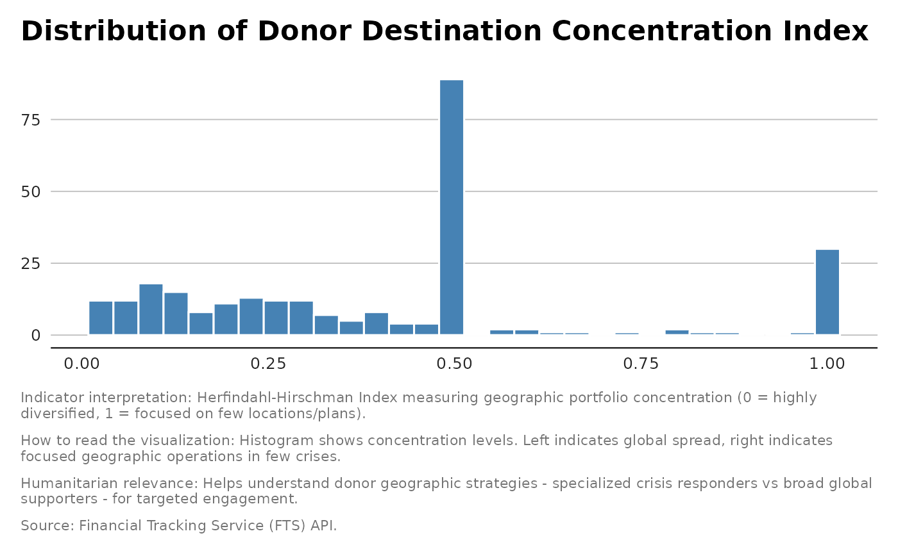

### indicator_donor_destination_earmarking_flexibility

``` r
donor_destination <- indicator_donor_destination_earmarking_flexibility(flows)
#table(donor_destination$Earmarking_Flexibility)
donor_destination <- indicator_donor_destination_earmarking_flexibility(flows)

# ---- Select top donors & top destinations by total USD ----
top_donors <- donor_destination |>
  dplyr::group_by(donor) |>
  dplyr::summarise(total = sum(total_amount, na.rm = TRUE)) |>
  dplyr::arrange(desc(total)) |>
  dplyr::slice_head(n = 15)

top_destinations <- donor_destination |>
  dplyr::group_by(destination) |>
  dplyr::summarise(total = sum(total_amount, na.rm = TRUE)) |>
  dplyr::arrange(desc(total)) |>
  dplyr::slice_head(n = 15)

donor_destination_top15 <- donor_destination |>
  dplyr::filter(
    donor %in% top_donors$donor,
    destination %in% top_destinations$destination
  )

# (Optional) reorder factors for readability
donor_destination_top15 <- donor_destination_top15 |>
  dplyr::mutate(
    donor = factor(donor, levels = sort(unique(donor))),
    destination = factor(destination, levels = sort(unique(destination)))
  )

# ---- ggplot2 heatmap ----
ggplot2::ggplot(
  donor_destination_top15,
  ggplot2::aes(
    x = destination,
    y = donor,
    fill = Earmarking_Flexibility
  )
) +
  ggplot2::geom_tile(color = "white") +

  # Color-blind friendly scale
  viridis::scale_fill_viridis(
    name = "Flexibility",
    option = "viridis",      # color-blind friendly
    direction = 1,
    limits = c(0.25, 1.0),
    na.value = "grey80"
  ) +
  ggplot2::labs(
    title = "Donor–Destination Earmarking Flexibility
    (Top 15 Donors & Destinations)",
    subtitle = "Weighted average flexibility score 
    (1.0 = unearmarked → 0.25 = tightly earmarked)",
    x = "Destination Country",
    y = "Donor",
    caption = paste(
    "Indicator interpretation:",
    "Weighted average earmarking flexibility for donor-destination pairs 
    (1=unearmarked, 0.75=softly earmarked, 0.5=earmarked, 0.25=tightly earmarked).",
    "\n\n",
    
    "How to read the visualization:",
    "Heatmap shows flexibility patterns. Darker colors indicate more flexible 
    funding arrangements between specific donor-destination combinations.", 
    "\n\n",
    
    "Humanitarian relevance:",
    "Identifies which donors provide flexible funding to specific crises,
    enabling context-responsive programming and local decision-making.", "\n\n",
    
    "Source: Financial Tracking Service (FTS) API."
  )
  ) +
  unhcrthemes::theme_unhcr(grid = "Y", axis = "X", axis_title = FALSE) +
  ggplot2::theme(
    axis.text.x = ggplot2::element_text(angle = 45, hjust = 1),
    legend.position = "right",
    panel.grid = ggplot2::element_blank()
  )
```

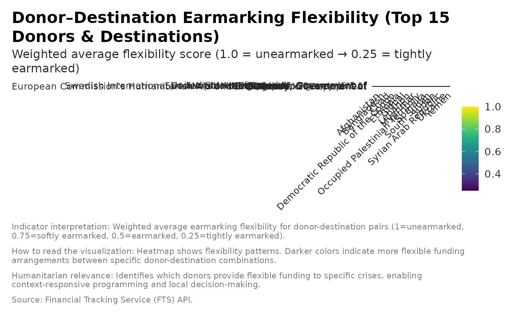

### indicator_donor_destination_risk_tolerance

``` r
donor_risk <- indicator_donor_destination_risk_tolerance(
  flows,
  high_risk_locations = c("Sudan", "South Sudan", "Somalia", "Afghanistan"),
  new_partners        = c("Local NGO A", "Community Org B")
)

# Identify top 15 donors by total contributions
top15 <- donor_risk |>
  dplyr::arrange(desc(total)) |>
  dplyr::slice_head(n = 15)

donor_risk_top15 <- donor_risk |>
  dplyr::filter(donor %in% top15$donor) |>
  dplyr::mutate(
    donor = factor(donor, levels = top15$donor)
  )

# ---- ggplot2 visualisation (viridis) ----
ggplot2::ggplot(
  donor_risk_top15,
  ggplot2::aes(
    x = donor,
    y = Risk_Tolerance,
    fill = Risk_Tolerance
  )
) +
  ggplot2::geom_col() +
  viridis::scale_fill_viridis(
    name = "Risk Tolerance",
    option = "viridis",
    direction = 1,
    limits = c(0, 1),
    na.value = "grey80"
  ) +
  ggplot2::coord_flip() +
  ggplot2::labs(
    title = "Donor Risk Tolerance (Top 15 Donors)",
    subtitle = "Share of funding directed to high-risk locations or new partners",
    x = "Donor",
    y = "Risk Tolerance (0–1)",
    caption = paste(
    "Indicator interpretation:",
    "Share of donor funding going to high-risk locations or new/untested partners.
    Higher values indicate greater risk tolerance in funding decisions.", "\n\n",
    
    "How to read the visualization:",
    "Bar chart shows risk tolerance levels across top donors. Higher bars 
    indicate donors more willing to fund in complex environments or with new 
    partners.", "\n\n",
    
    "Humanitarian relevance:",
    "Identifies donors supporting frontline response in most challenging 
    contexts and investing in local capacity building through new partnerships.",
    "\n\n",
    
    "Source: Financial Tracking Service (FTS) API."
  )
  ) +
  unhcrthemes::theme_unhcr(grid = "Y", axis = "X", axis_title = FALSE) +
  ggplot2::theme(
    panel.grid.minor = ggplot2::element_blank(),
    legend.position = "right"
  )
```

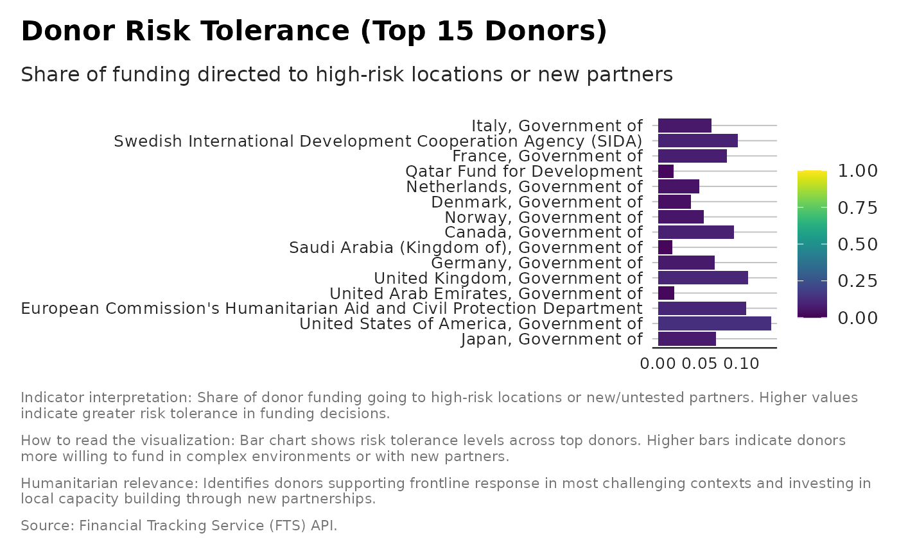

### indicator_donor_destination_stability

``` r
# Compute indicator
donor_destination<- indicator_donor_destination_stability(flows)

# Identify top 15 destinations by number of active donors or total flows
top_destinations <- donor_destination |>
  dplyr::group_by(destination) |>
  dplyr::summarise(total_stability = sum(DonorDestination_Stability_Index,
                                         na.rm = TRUE)) |>
  dplyr::arrange(desc(total_stability)) |>
  dplyr::slice_head(n = 15)

stability_top <- donor_destination |>
  dplyr::filter(destination %in% top_destinations$destination) |>
  dplyr::mutate(
    destination = factor(destination, levels = top_destinations$destination),
    donor = factor(donor)
  )

# ---- ggplot2 visualisation ----
ggplot2::ggplot(
  stability_top,
  ggplot2::aes(
    x = destination,
    y = donor,
    fill = DonorDestination_Stability_Index
  )
) +
  ggplot2::geom_tile(color = "white") +
  
  viridis::scale_fill_viridis(
    name = "Stability (0–1)",
    option = "viridis",
    limits = c(0, 1),
    na.value = "grey80"
  ) +
  
  ggplot2::labs(
    title = "Donor → Destination Geographic Stability Index",
    subtitle = "Share of years each donor funded a destination
    (0 = occasional; 1 = consistent every year)",
    x = "Destination",
    y = "Donor",
    caption = paste(
    "Indicator interpretation:",
    "Proportion of years with active funding between donor-destination pairs
    (0=sporadic engagement, 1=consistent annual funding throughout period).", 
    "\n\n",
    
    "How to read the visualization:",
    "Heatmap shows funding consistency patterns. Darker colors indicate stable 
    long-term donor engagement in specific crisis contexts.", "\n\n",
    
    "Humanitarian relevance:",
    "Identifies donors providing predictable funding to specific crises, 
    enabling long-term programming and sustainable response capacity building.", 
    "\n\n",
    
    "Source: Financial Tracking Service (FTS) API."
  )
  ) +
  
  unhcrthemes::theme_unhcr(grid = "Y", axis = "X", axis_title = FALSE) +
  ggplot2::theme(
    axis.text.x = ggplot2::element_text(angle = 45, hjust = 1),
    panel.grid = ggplot2::element_blank(),
    legend.position = "right"
  )
```

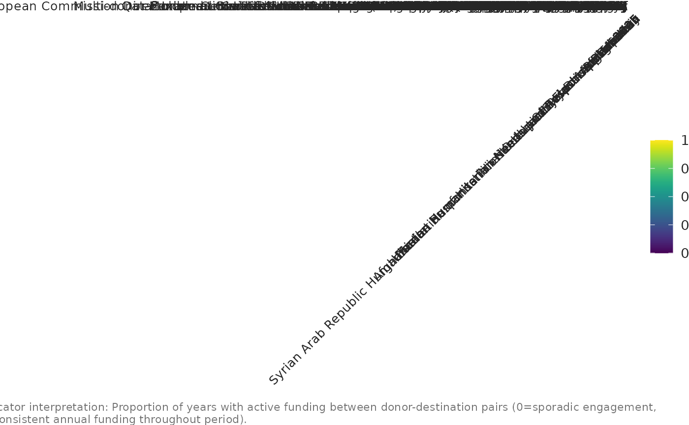

## Recipient

### indicator_recipient_funding_share

``` r
recipients <- indicator_recipient_funding_share(flows)
#table(recipients$Funding_Volume_Share)

library(ggplot2)
# Basic histogram of Knowledge Sharing Intensity
ggplot(recipients, aes(x = Funding_Volume_Share)) +
  geom_histogram( fill = "lightgreen", color = "white") +
  unhcrthemes::theme_unhcr(grid = "Y", axis = "X", axis_title = FALSE) +
  labs(
    title = "Distribution of Recipients Funding Volume Share",
    x = "",
    y = "Number of Recipients",
    caption = paste(
    "Indicator interpretation:",
    "Measures the proportion of total humanitarian funding received by each 
    recipient organization. Higher values indicate larger market share.", 
    "\n\n",
    
    "How to read the visualization:",
    "X-axis shows funding share (0-1), Y-axis shows recipient count. Most 
    recipients will have small shares, few will dominate (right tail).", "\n\n",
    
    "Humanitarian relevance:",
    "Identifies major implementing partners and market concentration, helping 
    understand dependency risks and partnership opportunities.", "\n\n",
    
    "Source: Financial Tracking Service (FTS) API."
  )
  )
#> `stat_bin()` using `bins = 30`. Pick better value `binwidth`.
```

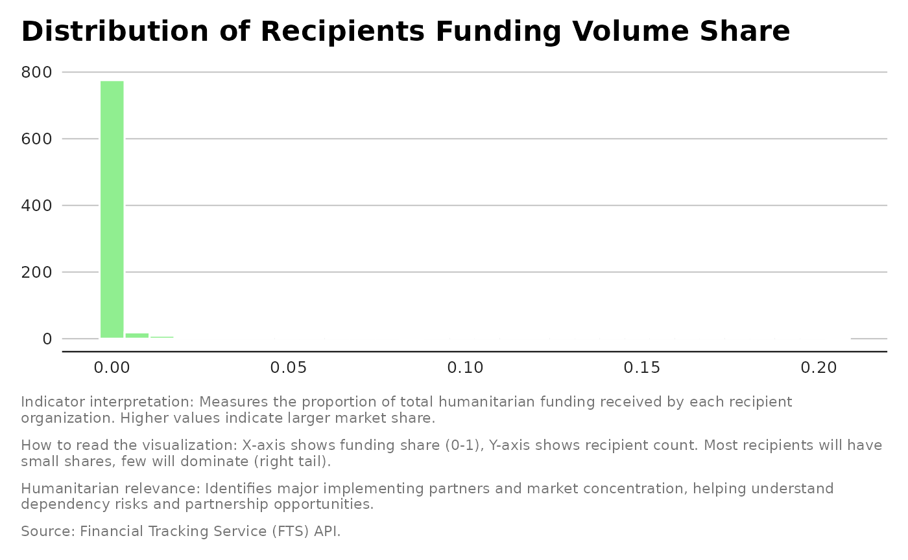

### indicator_recipient_amount_stability

``` r

recipients <- indicator_recipient_amount_stability(flows)
#table(recipients$Amount_Stability)

library(ggplot2)
ggplot(recipients, aes(x = Amount_Stability)) +
  geom_histogram( fill = "lightgreen", color = "white") +
  unhcrthemes::theme_unhcr(grid = "Y", axis = "X", axis_title = FALSE) +
  labs(
    title = "Distribution of Recipients Amount Stability",
    x = "",
    y = "Number of Recipients",
    caption = paste(
    "Indicator interpretation:",
    "Measures year-to-year funding stability as 1 minus coefficient of variation.
    1 = perfectly stable annual funding, lower values = volatile funding 
    patterns.", "\n\n",
    
    "How to read the visualization:",
    "Histogram shows stability scores. Higher values indicate predictable funding
    streams, negative values indicate high volatility (SD > mean).", "\n\n",
    
    "Humanitarian relevance:",
    "Stable funding enables long-term programming and institutional strengthening,
    while volatility disrupts operations and staff retention.", "\n\n",
    
    "Source: Financial Tracking Service (FTS) API."
  )
  )
#> `stat_bin()` using `bins = 30`. Pick better value `binwidth`.
#> Warning: Removed 455 rows containing non-finite outside the scale range
#> (`stat_bin()`).
```

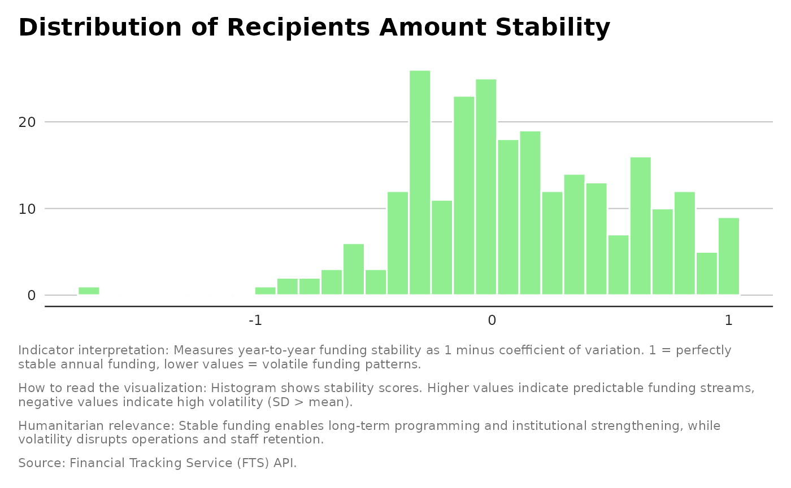

### indicator_recipient_cofunding_rate

``` r
recipients <- indicator_recipient_cofunding_rate(flows)
#table(recipients$Co_Funding_Rate)

library(ggplot2)
ggplot(recipients, aes(x = Co_Funding_Rate)) +
  geom_histogram( fill = "lightgreen", color = "white") +
  unhcrthemes::theme_unhcr(grid = "Y", axis = "X", axis_title = FALSE) +
  labs(
    title = "Distribution of Recipients CoFunding Rate",
    x = "",
    y = "Number of Recipients",
    caption = paste(
    "Indicator interpretation:",
    "Percentage of funding flows where recipient shares funding with other 
    organizations (not sole recipient). 0 = always sole recipient, 
    1 = always co-funded.", "\n\n",
    
    "How to read the visualization:",
    "Histogram shows co-funding frequency. Higher values indicate collaborative
    funding arrangements, lower values indicate standalone projects.", "\n\n",
    
    "Humanitarian relevance:",
    "Identifies organizations experienced in consortium work and coordination,
    crucial for complex multi-partner responses and integrated programming.", 
    "\n\n",
    
    "Source: Financial Tracking Service (FTS) API."
  )
  )
#> `stat_bin()` using `bins = 30`. Pick better value `binwidth`.
```


### indicator_recipient_systemic_diversification

``` r
recipients <- indicator_recipient_systemic_diversification(flows)
#table(recipients$Recipient_Diversification_Index)

library(ggplot2)
ggplot(recipients, aes(x = Recipient_Diversification_Index)) +
  geom_histogram( fill = "lightgreen", color = "white") +
  unhcrthemes::theme_unhcr(grid = "Y", axis = "X", axis_title = FALSE) +
  labs(
    title = "Distribution of Recipient Diversification Index",
    x = "",
    y = "Number of Recipients",
    caption = paste(
    "Indicator interpretation:",
    "Entropy-based measure of funding source diversification across donors. 
    0 = dependent on single donor,
    1 = perfectly diversified across many donors.", "\n\n",
    
    "How to read the visualization:",
    "Histogram shows diversification levels. Higher values indicate resilient 
    funding bases, lower values indicate donor concentration risks.", "\n\n",
    
    "Humanitarian relevance:",
    "Diversified funding reduces vulnerability to individual donor policy 
    changes and enhances organizational sustainability and independence.", "\n\n",
    
    "Source: Financial Tracking Service (FTS) API."
  )
  )
#> `stat_bin()` using `bins = 30`. Pick better value `binwidth`.
#> Warning: Removed 469 rows containing non-finite outside the scale range
#> (`stat_bin()`).
```

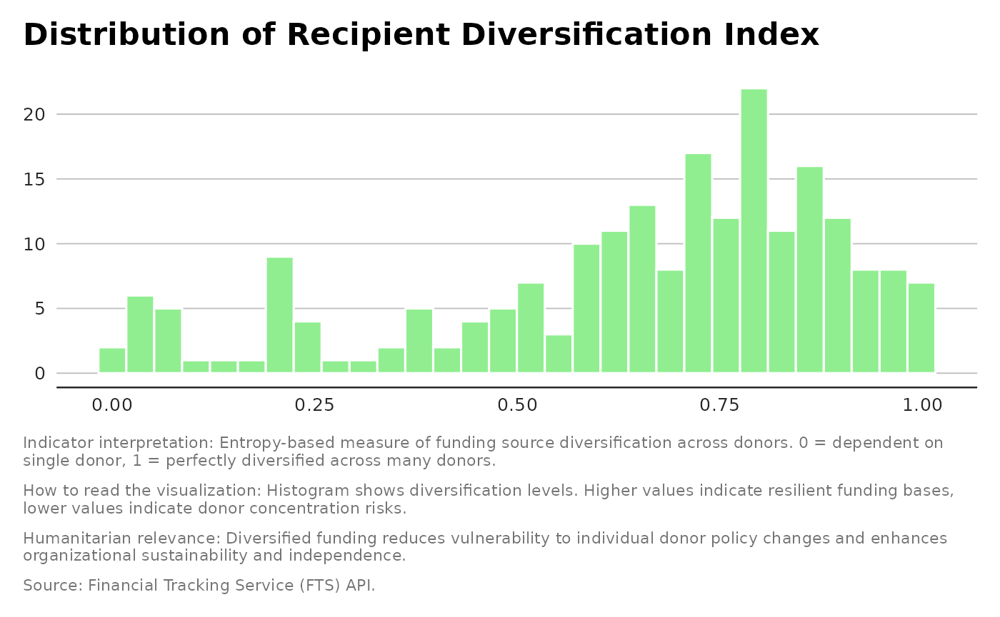

## Destination

### indicator_destination_modality_innovation

``` r
destination <- indicator_destination_modality_innovation(flows)
#table(destination $Recipient_Diversification_Index)

library(ggplot2)
ggplot(destination, aes(x = Modality_Innovation)) +
  geom_histogram( fill = "red", color = "white") +
  unhcrthemes::theme_unhcr(grid = "Y", axis = "X", axis_title = FALSE) +
  labs(
    title = "Distribution of Destination Modality Innovation",
    x = "",
    y = "Number of Destination",
    caption = paste(
    "Indicator interpretation:",
    "Percentage of funding using Cash Transfer Programming (CTP) per destination.
    Higher values indicate greater adoption of innovative cash-based approaches.",
    "\n\n",
    
    "How to read the visualization:",
    "Histogram shows CTP adoption rates across destinations. Right-skewed 
    distribution indicates most destinations have low CTP usage, few are CTP 
    leaders.", "\n\n",
    
    "Humanitarian relevance:",
    "Cash programming increases efficiency, dignity, and local market benefits.
    Identifies destinations where cash coordination capacity may need 
    strengthening.", "\n\n",
    
    "Source: Financial Tracking Service (FTS) API."
  )
  )
#> `stat_bin()` using `bins = 30`. Pick better value `binwidth`.
```

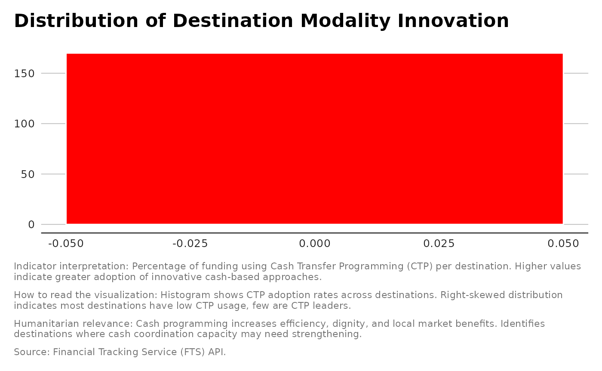

### indicator_destination_pipeline_visibility

``` r
destination <- indicator_destination_pipeline_visibility(flows)
#table(destination$Recipient_Diversification_Index)

library(ggplot2)
ggplot(destination, aes(x = Pipeline_Visibility)) +
  geom_histogram( fill = "red", color = "white") +
  unhcrthemes::theme_unhcr(grid = "Y", axis = "X", axis_title = FALSE) +
  labs(
    title = "Distribution of Destination Pipeline Visibility",
    x = "",
    y = "Number of Destination",
    caption = paste(
    "Indicator interpretation:",
    "Proportion of funding flows extending beyond current year. Higher values
    indicate better forward visibility and multi-year planning capacity.",
    "\n\n",
    
    "How to read the visualization:",
    "Histogram shows pipeline visibility across destinations. Most destinations
    cluster near zero, indicating predominantly annual funding cycles.", "\n\n",
    
    "Humanitarian relevance:",
    "Multi-year funding enables strategic programming, staff retention, and
    sustainable crisis response rather than short-term emergency patches.",
    "\n\n",
    
    "Source: Financial Tracking Service (FTS) API."
  )
  )
#> `stat_bin()` using `bins = 30`. Pick better value `binwidth`.
```


### indicator_destination_earmarking_flexibility

``` r
destination <- indicator_destination_earmarking_flexibility(flows)
#table(destination$Earmarking_Flexibility)

library(ggplot2)
ggplot(destination, aes(x = Earmarking_Flexibility)) +
  geom_histogram( fill = "red", color = "white") +
  unhcrthemes::theme_unhcr(grid = "Y", axis = "X", axis_title = FALSE) +
  labs(
    title = "Distribution of Destination Earmarking Flexibility",
    x = "",
    y = "Number of Destination",
    caption = paste(
    "Indicator interpretation:",
    "Weighted average of earmarking flexibility (1=unearmarked, 0.75=softly
    earmarked, 0.5=earmarked, 0.25=tightly earmarked). Higher values indicate 
    more flexible funding.", "\n\n",
    
    "How to read the visualization:",
    "Histogram shows flexibility scores. Higher values indicate destinations 
    receiving more unearmarked funding for adaptive programming.", "\n\n",
    
    "Humanitarian relevance:",
    "Flexible funding enables context-responsive programming, local leadership, 
    and efficient resource allocation based on evolving needs rather than 
    rigid donor requirements.", "\n\n",
    
    "Source: Financial Tracking Service (FTS) API."
  )
  )
#> `stat_bin()` using `bins = 30`. Pick better value `binwidth`.
```

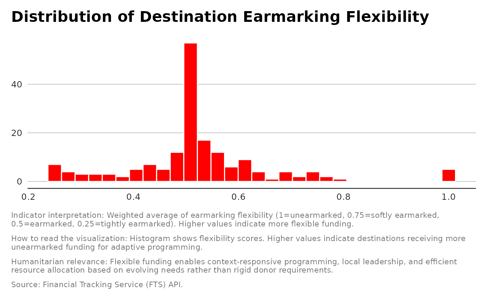

### indicator_destination_donor_diversity

``` r
destination <- indicator_destination_donor_diversity(flows)
#table(destination$Earmarking_Flexibility)

library(ggplot2)
ggplot(destination, aes(x = Destination_Donor_Diversity_Index)) +
  geom_histogram( fill = "red", color = "white") +
  unhcrthemes::theme_unhcr(grid = "Y", axis = "X", axis_title = FALSE) +
  labs(
    title = "Distribution of Destination Donor Diversity Index",
    x = "",
    y = "Number of Destination",
    caption = paste(
    "Indicator interpretation:",
    "Inverse Herfindahl-Hirschman Index measuring donor diversification 
    (0=single donor dependency, 1=highly diversified funding base).", "\n\n",
    
    "How to read the visualization:",
    "Histogram shows diversification levels. Higher values indicate resilient
    funding ecosystems, lower values indicate vulnerability to individual
    donor decisions.", "\n\n",
    
    "Humanitarian relevance:",
    "Diversified funding reduces crisis vulnerability to donor policy changes
    and ensures more stable response capacity during political shifts.", "\n\n",
    
    "Source: Financial Tracking Service (FTS) API."
  )
  )
#> `stat_bin()` using `bins = 30`. Pick better value `binwidth`.
```

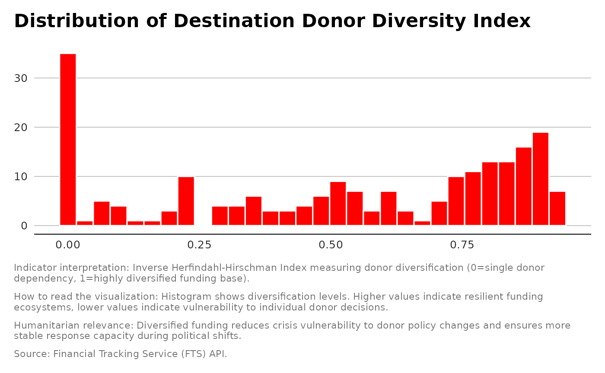

### indicator_destination_funding_stability

``` r
destination <- indicator_destination_funding_stability(flows)
#table(destination$Destination_Funding_Stability_Index)

library(ggplot2)
ggplot(destination, aes(x = Destination_Funding_Stability_Index)) +
  geom_histogram( fill = "red", color = "white") +
  unhcrthemes::theme_unhcr(grid = "Y", axis = "X", axis_title = FALSE) +
  labs(
    title = "Distribution of Destination Funding Stability Index",
    x = "",
    y = "Number of Destination",
    caption = paste(
    "Indicator interpretation:",
    "1 minus coefficient of variation of annual funding amounts. 
    1=perfectly stable, lower values=volatile funding, 
    negative values=high volatility (SD > mean).", "\n\n",
    
    "How to read the visualization:",
    "Histogram shows stability patterns. Higher values enable predictable 
    programming, negative values indicate boom-bust cycles disrupting operations.",
    "\n\n",
    
    "Humanitarian relevance:",
    "Funding stability enables long-term planning, staff retention, and 
    consistent service delivery rather than reactive emergency-only responses.",
    "\n\n",
    
    "Source: Financial Tracking Service (FTS) API."
  )
  )
#> `stat_bin()` using `bins = 30`. Pick better value `binwidth`.
#> Warning: Removed 45 rows containing non-finite outside the scale range
#> (`stat_bin()`).
```

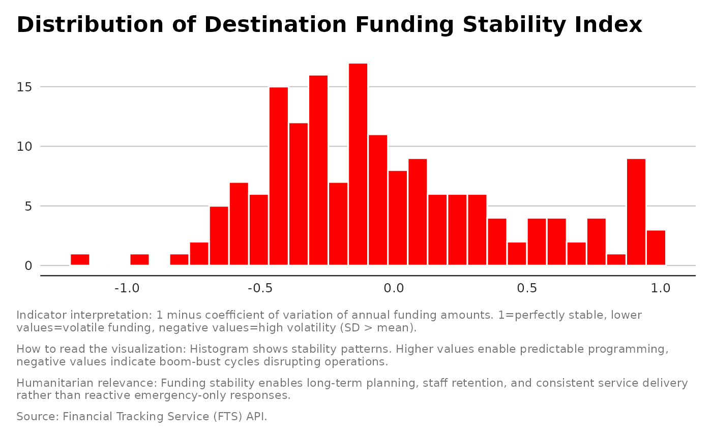

### indicator_destination_funding_trend

``` r
destination <- indicator_destination_funding_trend(flows)
#table(destination$Destination_Funding_Growth_Trend)

library(ggplot2)
ggplot(destination, aes(x = Destination_Funding_Growth_Trend)) +
  geom_histogram( fill = "red", color = "white") +
  unhcrthemes::theme_unhcr(grid = "Y", axis = "X", axis_title = FALSE) +
  labs(
    title = "Distribution of Destination Funding Growth Trend",
    x = "",
    y = "Number of Destination",
    caption = paste(
    "Indicator interpretation:",
    "Linear regression slope of annual funding over time. 
    Positive values=increasing funding, negative values=decreasing funding,
    zero=stable funding.", "\n\n",
    
    "How to read the visualization:",
    "Histogram shows growth/decline patterns. Right of zero indicates expanding
    crisis responses, left indicates potential donor fatigue or improving 
    contexts.", "\n\n",
    
    "Humanitarian relevance:",
    "Identifies crises receiving increasing attention vs. those facing funding
    declines despite ongoing needs, informing advocacy priorities.", "\n\n",
    
    "Source: Financial Tracking Service (FTS) API."
  )
  )
#> `stat_bin()` using `bins = 30`. Pick better value `binwidth`.
#> Warning: Removed 45 rows containing non-finite outside the scale range
#> (`stat_bin()`).
```

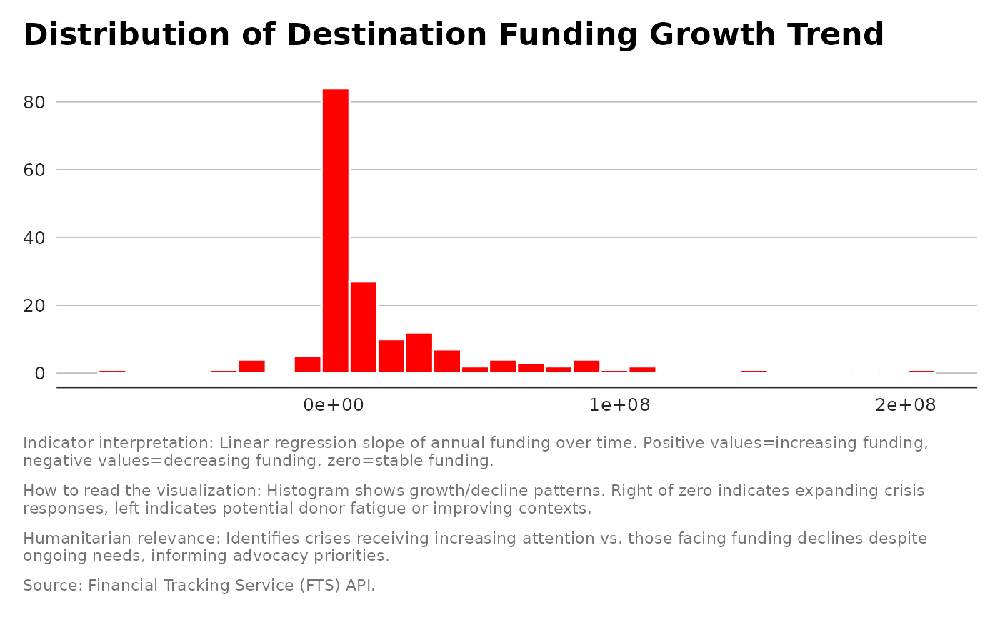

### indicator_destination_donor_retention

``` r
destination <- indicator_destination_donor_retention(flows)
#table(destination$Destination_Donor_Retention_Index)

library(ggplot2)
ggplot(destination, aes(x = Destination_Donor_Retention_Index)) +
  geom_histogram( fill = "red", color = "white") +
  unhcrthemes::theme_unhcr(grid = "Y", axis = "X", axis_title = FALSE) +
  labs(
    title = "Distribution of Destination Donor Retention Index",
    x = "",
    y = "Number of Destination",
    caption = paste(
    "Indicator interpretation:",
    "Proportion of donors who continue funding a destination year after year. 
    Higher values indicate loyal donor bases and sustained engagement.", "\n\n",
    
    "How to read the visualization:",
    "Histogram shows retention rates. Higher values indicate stable donor 
    relationships, lower values indicate high donor turnover and relationship
    building needs.", "\n\n",
    
    "Humanitarian relevance:",
    "Donor retention reduces transaction costs, builds contextual knowledge, 
    and enables more effective long-term partnerships in complex crises.",
    "\n\n",
    
    "Source: Financial Tracking Service (FTS) API."
  )
  )
#> `stat_bin()` using `bins = 30`. Pick better value `binwidth`.
```

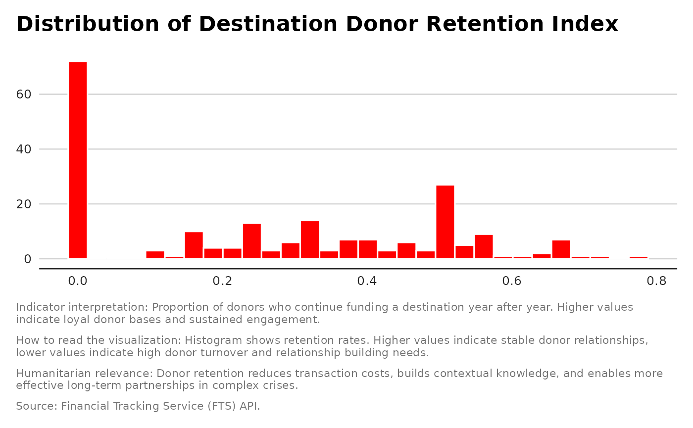

### indicator_destination_funding_diversity

``` r
destination <- indicator_destination_funding_diversity(flows)
#table(destination$Destination_Funding_Diversity)

library(ggplot2)
ggplot(destination, aes(x = Destination_Funding_Diversity)) +
  geom_histogram( fill = "red", color = "white") +
  unhcrthemes::theme_unhcr(grid = "Y", axis = "X", axis_title = FALSE) +
  labs(
    title = "Distribution of Destination Funding Diversity",
    x = "",
    y = "Number of Destination",
    caption = paste(
    "Indicator interpretation:",
    "Shannon entropy-based measure of funding distribution across donors 
    (0=single donor dominance, 1=perfect diversity across many donors).", "\n\n",
    
    "How to read the visualization:",
    "Histogram shows diversity levels. Higher values indicate resilient funding
    ecosystems, lower values indicate concentration risks and vulnerability.",
    "\n\n",
    
    "Humanitarian relevance:",
    "Diverse funding bases protect against individual donor withdrawals and
    enable more balanced response coordination across multiple priorities.", 
    "\n\n",
    
    "Source: Financial Tracking Service (FTS) API."
  )
  )
#> `stat_bin()` using `bins = 30`. Pick better value `binwidth`.
#> Warning: Removed 31 rows containing non-finite outside the scale range
#> (`stat_bin()`).
```

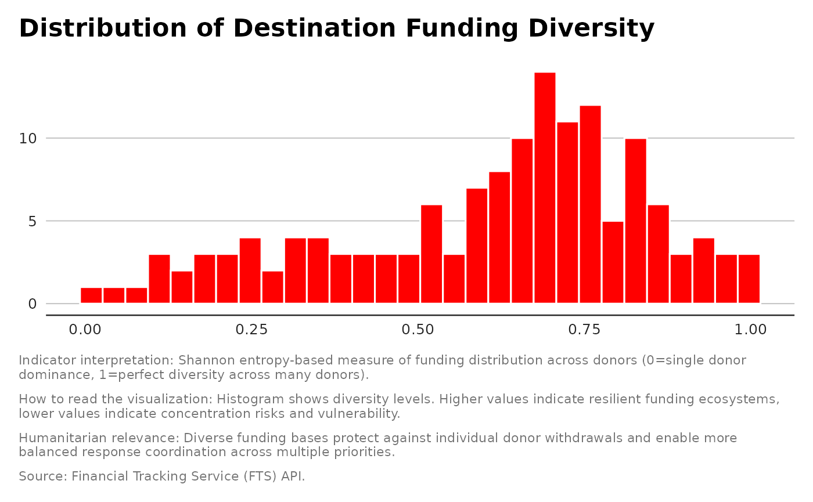

### indicator_destination_funding_volatility

``` r
destination <-indicator_destination_funding_volatility(flows)
#table(destination$Destination_Funding_Volatility)

library(ggplot2)
ggplot(destination, aes(x = Destination_Funding_Volatility)) +
  geom_histogram( fill = "red", color = "white") +
  unhcrthemes::theme_unhcr(grid = "Y", axis = "X", axis_title = FALSE) +
  labs(
    title = "Distribution of Destination Funding Volatility",
    x = "",
    y = "Number of Destination",
    caption = paste(
    "Indicator interpretation:",
    "1 minus coefficient of variation of annual funding (0=highly volatile,
    1=perfectly stable). Inverse measure of year-to-year funding
    unpredictability.", "\n\n",
    
    "How to read the visualization:",
    "Histogram shows volatility patterns. Higher values enable predictable 
    programming, lower values indicate disruptive funding fluctuations.", "\n\n",
    
    "Humanitarian relevance:",
    "Funding volatility disrupts staffing, procurement, and program continuity, 
    reducing operational efficiency and response effectiveness.", "\n\n",
    
    "Source: Financial Tracking Service (FTS) API."
  )
  )
#> `stat_bin()` using `bins = 30`. Pick better value `binwidth`.
#> Warning: Removed 44 rows containing non-finite outside the scale range
#> (`stat_bin()`).
```

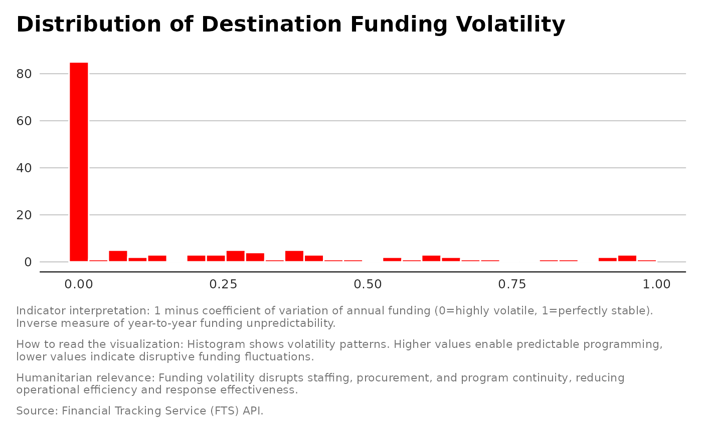

### indicator_destination_dependency

``` r
destination <-indicator_destination_dependency(flows)
#table(destination$Destination_Dependency_Index)

library(ggplot2)
ggplot(destination, aes(x = Destination_Dependency_Index)) +
  geom_histogram( fill = "red", color = "white") +
  unhcrthemes::theme_unhcr(grid = "Y", axis = "X", axis_title = FALSE) +
  labs(
    title = "Distribution of Destination Dependency Index",
    x = "",
    y = "Number of Destination",
    caption = paste(
    "Indicator interpretation:",
    "Share of total funding from largest single donor (0-1). Higher values 
    indicate heavy reliance on one donor, creating vulnerability.", "\n\n",
    
    "How to read the visualization:",
    "Histogram shows dependency levels. Values near 1 indicate high-risk 
    single-donor dependencies requiring diversification strategies.", "\n\n",
    
    "Humanitarian relevance:",
    "Single-donor dependency creates systemic risk - if that donor changes 
    priorities, entire crisis responses can be jeopardized.", "\n\n",
    
    "Source: Financial Tracking Service (FTS) API."
  )
  )
#> `stat_bin()` using `bins = 30`. Pick better value `binwidth`.
```

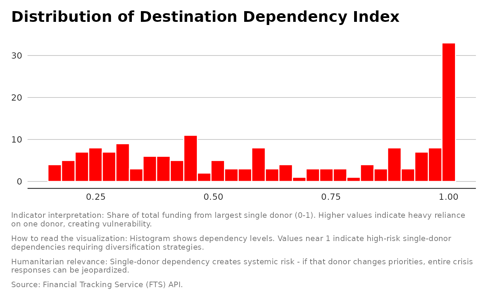

### indicator_destination_modality_balance

``` r
destination <- indicator_destination_modality_balance(flows)
#table(destination$Destination_Modality_Balance)

library(ggplot2)
ggplot(destination, aes(x = Destination_Modality_Balance)) +
  geom_histogram( fill = "red", color = "white") +
  unhcrthemes::theme_unhcr(grid = "Y", axis = "X", axis_title = FALSE) +
  labs(
    title = "Distribution of Destination Modality Balance",
    x = "",
    y = "Number of Destination",
    caption = paste(
    "Indicator interpretation:",
    "Share of cash-based programming (CTP) relative to all modalities (0-1).
    Higher values indicate greater cash modality utilization.", "\n\n",
    
    "How to read the visualization:",
    "Histogram shows CTP adoption across destinations. Most destinations cluster
    near zero, indicating traditional in-kind programming dominance.", "\n\n",
    
    "Humanitarian relevance:",
    "Appropriate modality balance ensures efficient, dignified assistance while
    maintaining essential in-kind support where markets are non-functional.",
    "\n\n",
    
    "Source: Financial Tracking Service (FTS) API."
  )
  )
#> `stat_bin()` using `bins = 30`. Pick better value `binwidth`.
```

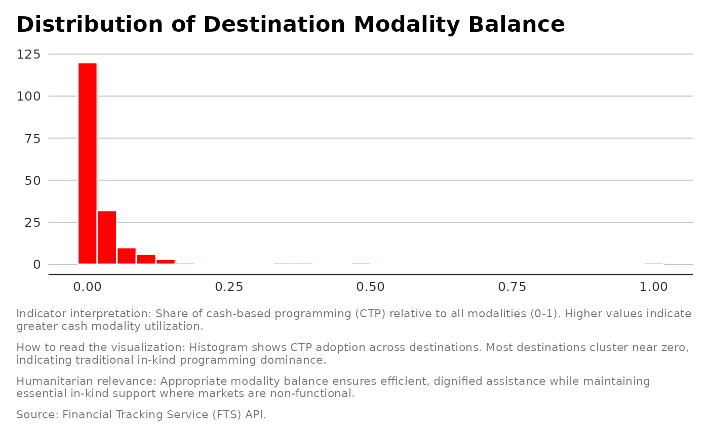
