# Doc-5-Visualisation

``` r
library(ftsAnalysis)
#> Registered S3 method overwritten by 'quantmod':
#>   method            from
#>   as.zoo.data.frame zoo
```

## Using Language Models to build data stories

### clean_llm_response

``` r
response <- "<think>
First, I'm a humanitarian data visualization expert. My role includes extracting insights 
from visualizations, creating accessible narratives, highlighting patterns relevant to aid
efforts, using clear language with emotional resonance.
Aligning with constraints: Use plain language, be concise and impactful. Don't rehash 
every detail; build narrative depth around 2 key insights maximum in under 30 tokens.
</think>
This visualization tracks a relationship potentially critical for humanitarian logistics: 
higher fuel consumption versus increased weight. 车辆设计"
clean_llm_response(response)
#> [1] "This visualization tracks a relationship potentially critical for humanitarian logistics: higher fuel consumption versus increased weight."
```

### generate_plot_story

``` r

library(ggplot2)
p <- ggplot(mtcars, aes(x = wt, y = mpg)) +
   geom_point() +
    unhcrthemes::theme_unhcr(grid = "Y", axis = "X", axis_title = FALSE) +
   labs(title = "Vehicle Efficiency",
        subtitle = "Fuel consumption vs weight",
        caption = "Source: mtcars dataset")

generate_plot_story(p, provider = "ollama", model = "deepseek-r1")
#> [1] "This scatter plot reveals: There exists an efficiency threshold: cars clearly above this cluster (e.g., Chevrolet, maybe Toyota at point 4) achieve significantly better fuel economy than the majority of vehicles."

story <- generate_plot_story(p, provider = "azure", model = "gpt-4.1-mini", max_tokens = 300)
# To use as subtitle:
p + ggplot2::labs(subtitle = story)
```


## Donor Plots

### plot_donor_funding_over_time

``` r
p <- plot_donor_funding_over_time(flows, donor_name= "Spain, Government of")
#> Warning: Using `size` aesthetic for lines was deprecated in ggplot2 3.4.0.
#> ℹ Please use `linewidth` instead.
#> ℹ The deprecated feature was likely used in the ftsAnalysis package.
#>   Please report the issue at
#>   <https://github.com/edouard-legoupil/ftsAnalysis/issues>.
#> This warning is displayed once every 8 hours.
#> Call `lifecycle::last_lifecycle_warnings()` to see where this warning was
#> generated.
# and plot with more powerful subtitle
dubbed <- generate_plot_story(p, provider = "azure", model = "gpt-4.1-mini")
print(p + ggplot2::labs(subtitle = dubbed))
```

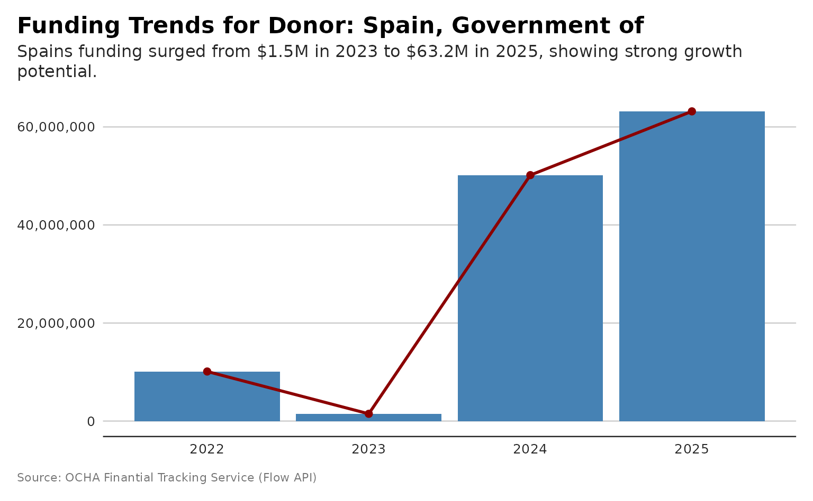

### plot_donor_earmarking

``` r
p <- plot_donor_earmarking(flows, donor_name= "Spain, Government of")
# and plot with more powerful subtitle
dubbed <- generate_plot_story(p, provider = "azure", model = "gpt-4.1-mini")
p + ggplot2::labs(subtitle = dubbed)
```

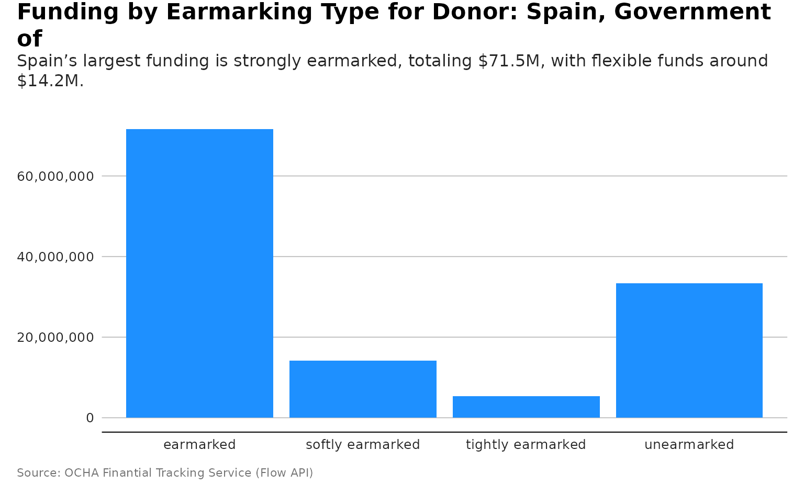

### plot_donor_flowtype

``` r
p <- plot_donor_flowtype(flows, donor_name= "Spain, Government of")
# and plot with more powerful subtitle
dubbed <- generate_plot_story(p, provider = "azure", model = "gpt-4.1-mini")
p + ggplot2::labs(subtitle = dubbed)
```

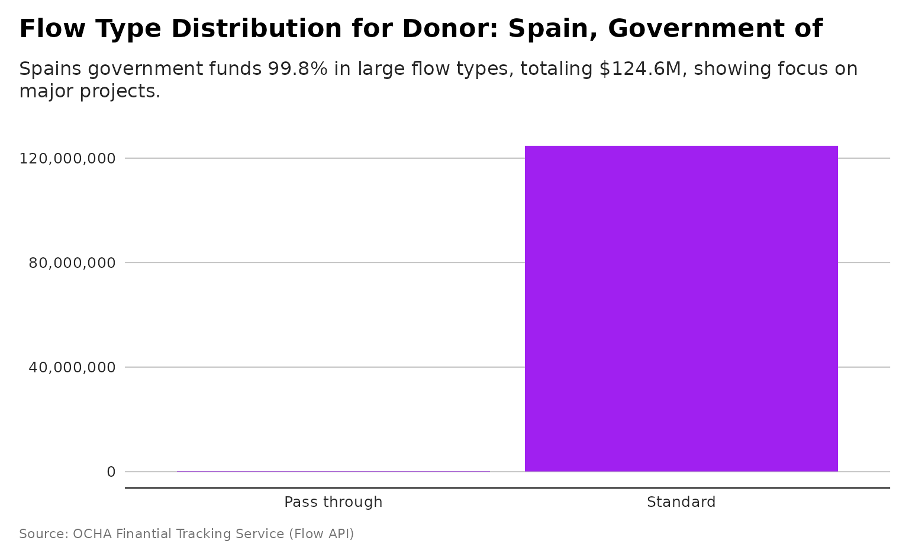

### plot_donor_cluster_coverage

``` r
p <- plot_donor_cluster_coverage(flows, donor_name= "Spain, Government of")
# and plot with more powerful subtitle
dubbed <- generate_plot_story(p, provider = "azure", model = "gpt-4.1-mini")
p + ggplot2::labs(subtitle = dubbed)
```

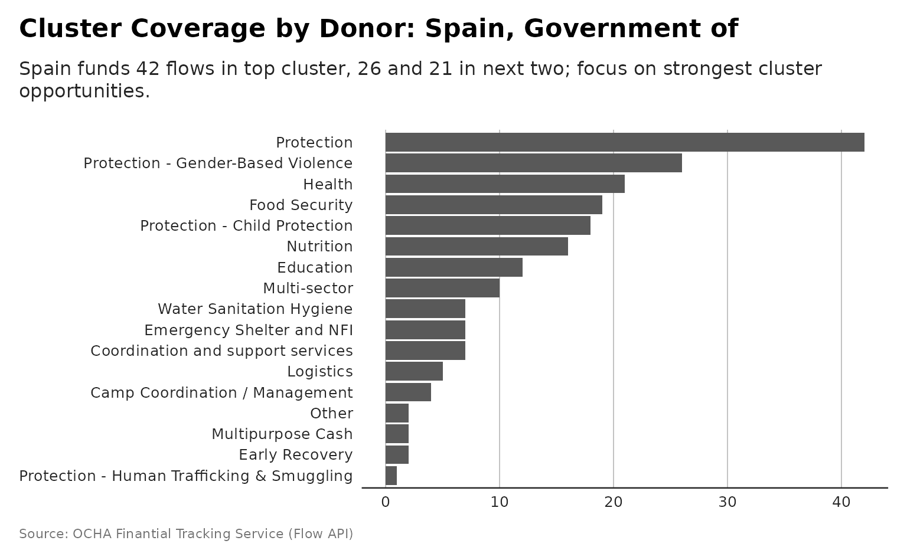

## Recipient Plot

### plot_recipient_funding_composition

``` r
p <- plot_recipient_funding_composition(flows, 
              recipient_name = "United Nations High Commissioner for Refugees")
# and plot with more powerful subtitle
dubbed <- generate_plot_story(p, provider = "azure", model = "gpt-4.1-mini")
p + ggplot2::labs(subtitle = dubbed)
```

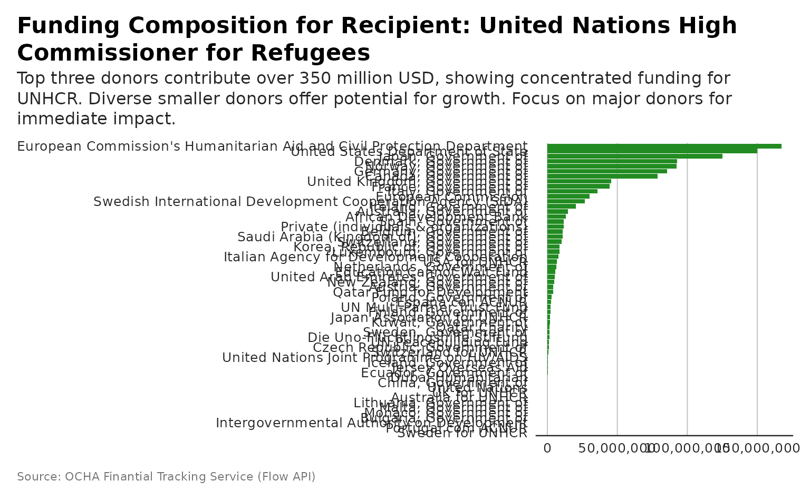

### plot_recipient_grandbargain

``` r
p <- plot_recipient_grandbargain(flows,
          recipient_name = "United Nations High Commissioner for Refugees")
#> Scale for y is already present.
#> Adding another scale for y, which will replace the existing scale.
# and plot with more powerful subtitle
dubbed <- generate_plot_story(p, provider = "azure", model = "gpt-4.1-mini")
p + ggplot2::labs(subtitle = dubbed)
```

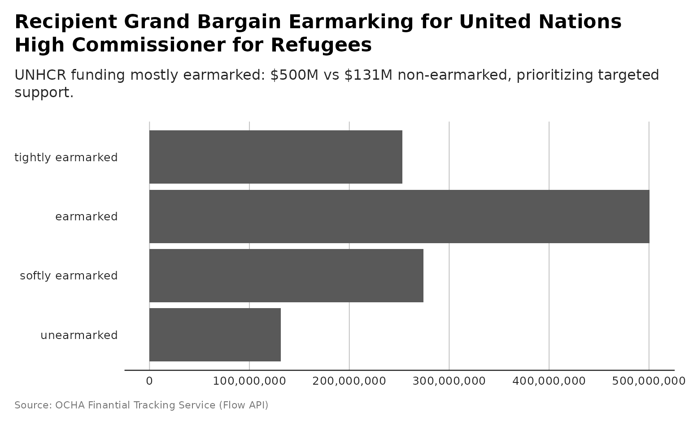

### plot_recipient_cofunding

``` r
p <- plot_recipient_cofunding(flows, 
              recipient_name = "United Nations High Commissioner for Refugees")
# and plot with more powerful subtitle
dubbed <- generate_plot_story(p, provider = "azure", model = "gpt-4.1-mini")
p + ggplot2::labs(subtitle = dubbed)
```

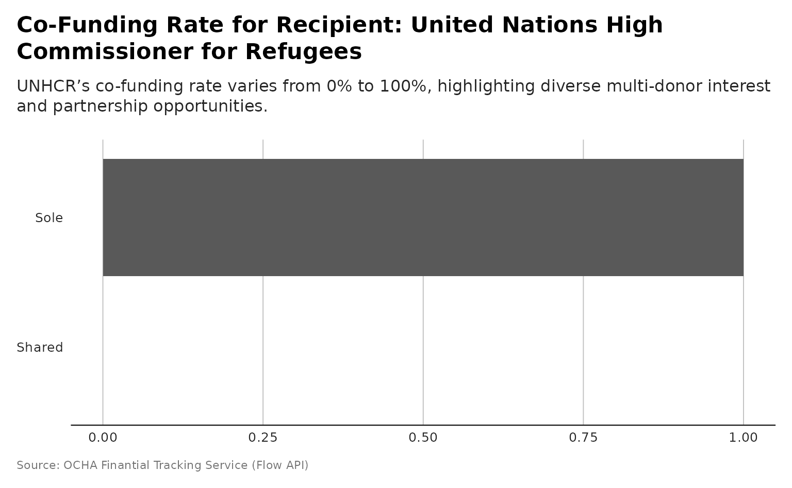

### plot_recipient_contribution_type

``` r
p <- plot_recipient_contribution_type(flows, 
                recipient_name = "United Nations High Commissioner for Refugees")
# and plot with more powerful subtitle
dubbed <- generate_plot_story(p, provider = "azure", model = "gpt-4.1-mini")
p + ggplot2::labs(subtitle = dubbed)
```

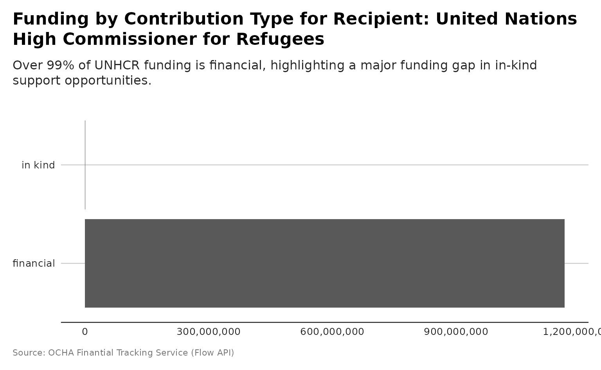

## Destination Plot

### plot_destination_funding_destination

``` r
p <- plot_destination_funding_destination(flows, destination_name= "Burundi")
# and plot with more powerful subtitle
dubbed <- generate_plot_story(p, provider = "azure", model = "gpt-4.1-mini")
p + ggplot2::labs(subtitle = dubbed)
```

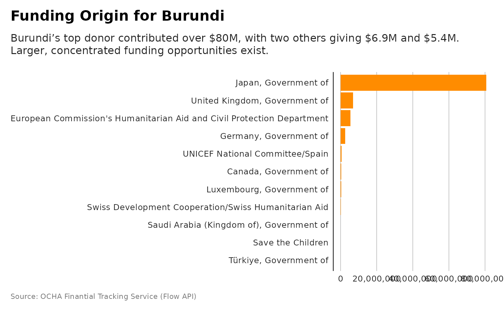

### plot_destination_funding_donor

``` r
p <- plot_destination_funding_donor(flows, destination_name= "Burundi")
# and plot with more powerful subtitle
dubbed <- generate_plot_story(p, provider = "azure", model = "gpt-4.1-mini")
p + ggplot2::labs(subtitle = dubbed)
```

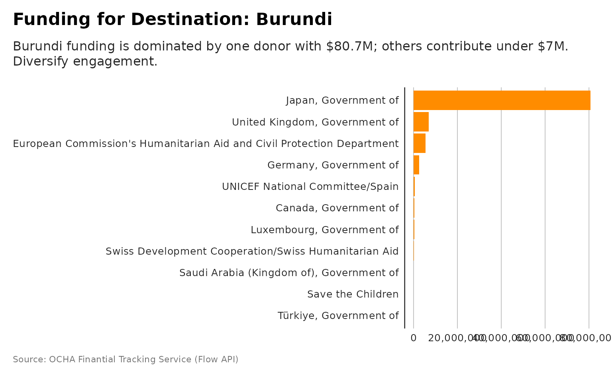

### plot_destination_heatmap

``` r
p <- plot_destination_heatmap(flows, destination_name= "Burundi", top_n = 5)
# and plot with more powerful subtitle
dubbed <- generate_plot_story(p, provider = "azure", model = "gpt-4.1-mini")
p + ggplot2::labs(subtitle = dubbed)
```

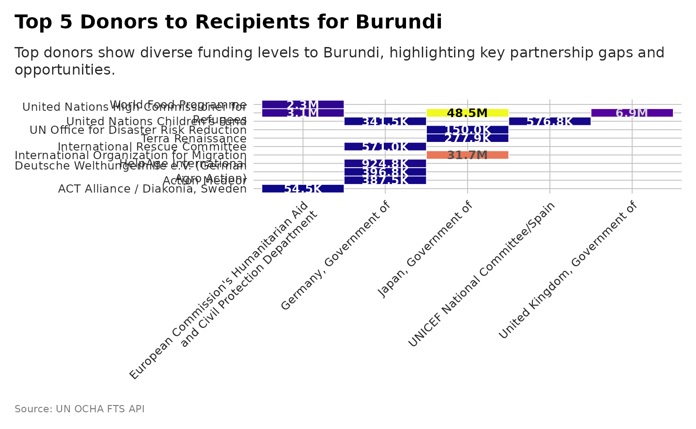

## Global Plot

### plot_funding_status_timeline

``` r
p <- plot_funding_status_timeline(flows)
# and plot with more powerful subtitle
dubbed <- generate_plot_story(p, provider = "azure", model = "gpt-4.1-mini")
p + ggplot2::labs(subtitle = dubbed)
```

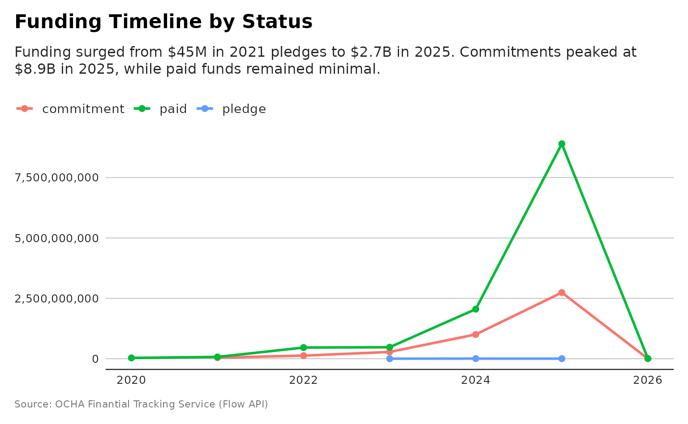
